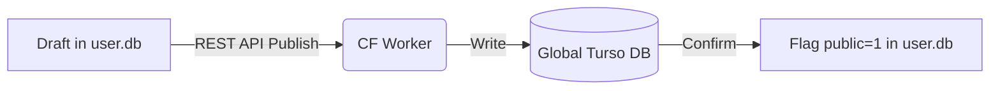
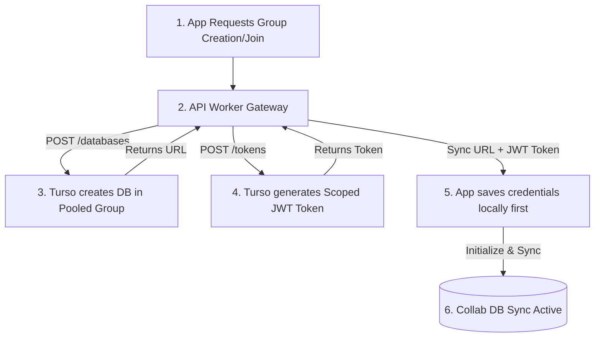
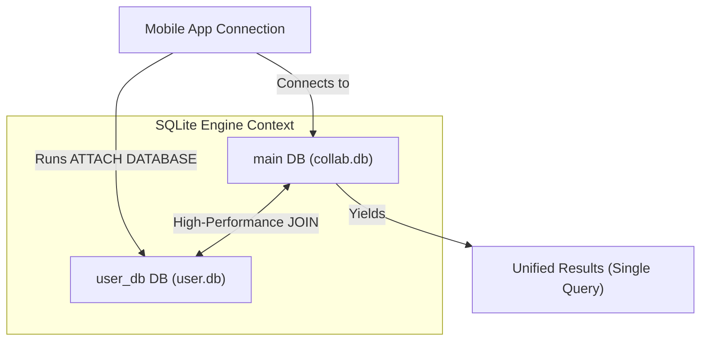

# Hybrid Collaborative Partitioning Plan (TAR Architecture)

This document presents a structured plan for optimizing storage, cost, and offline resilience by partitioning data between **`user.db`** (local-first, S3-backed) and **`collab.db`** (shared, real-time Turso-synced).

---

## 1. Storage Partitioning Strategy

Under this hybrid model, we strictly divide the five tables (`matter`, `mass`, `motion`, `relation`, `memory`) based on whether they represent **individual privacy/local state**, **shared team collaboration**, or **public catalog metadata**.

```
                         ┌──────────────────────────────────┐
                         │           Data Input             │
                         └────────────────┬─────────────────┘
                                          │
                  Is the data collaborative & real-time?
                  (e.g., KDS, Active Orders, Table Status)
                                   ├─── Yes ───► [ Collab DB ] (Turso Real-time Sync)
                                   │
                                   └─── No ────► [ User DB ] (Local-only) ──► S3 Backup
                                                      │
                                                      ▼
                                       Is it a public catalog item?
                                                      │
                                                      ▼ (Publish)
                                                [ Global DB ] (API Way / Pull Sync)
```

### Partitioning Matrix

| Table | What goes to `user.db` (Local + S3 Backup) | What goes to `collab.db` (Turso Sync) | What goes to `global.db` (API Publish / Pull Sync) |
| :--- | :--- | :--- | :--- |
| **`matter`** | • Private drafts of products/services<br>• Personal notes, tasks, checklists<br>• Local drafts of layouts/settings | • Shared active employee profiles<br>• Shared active categories/menu metadata | • Published public products & service listings<br>• Public storefront page configurations |
| **`mass`** | • Personal reminders & calendar alarms<br>• Individual vehicle log/fuel expenses<br>• Local private pricing lists | • Shared inventory stock counts<br>• Live table availability states<br>• Shared shift schedules & timesheets | • Global fallback pricing<br>• Standard storefront business hours |
| **`motion`** | • Personal activity history<br>• Private notes/diary entries<br>• Local drafts of orders/carts | • Shared order lifecycle (`ORDER_PLACED` → `SERVED`) <br>• Kitchen Display System events (`KDS_FIRED`) | • *None* (Public catalogs do not require transactional event streams) |
| **`relation`**| • Personal product categorization / links | • Store-to-product mapping (`SELLS`) | • Published product-to-category taxonomies |
| **`memory`** | • Vectors for searching private notes/tasks | • Vectors for searching shared collab logs | • Vectors for searching public products & stores |

---

## 1.5 Ownership & Management Roles (Who Manages What)

To prevent sync conflicts and data corruption, mutations are restricted by table and role:

| Table | Concept | Who Manages | Conflict Prevention Strategy |
| :--- | :--- | :--- | :--- |
| **`matter`** | Static Catalog Definitions | 👤 **One Main User** (Owner/Admin) | Drafted in `user.db`; published via Worker API with Optimistic Concurrency Control (OCC). |
| **`mass`** | Dynamic Realizations (Stock, Price) | 👥 **Multiple Staff** (Chefs, Inventory) | Written directly to `collab.db` with real-time Turso sync. |
| **`motion`** | Kinetics & Operations (Orders, Payments) | 👥 **Everyone** (Waiters, Cashiers) | Appended as independent transaction rows (avoids update conflicts). |

---

## 2. Dynamic Publishing Flow (User DB → Global DB)



| Step | State | Location | Action |
| :--- | :--- | :--- | :--- |
| **1. Draft** | `public = 0` | 📱 Local `user.db` | Saved locally offline. No sync overhead. |
| **2. Publish** | `pending` | 🌐 Worker API | Manager taps "Publish". Payload sent to Cloudflare Worker. |
| **3. Persist** | `public = 1` | ☁️ Global Turso DB | Worker writes to database and invalidates Cloudflare KV cache. |
| **4. Confirm** | `public = 1` | 📱 Local `user.db` | Device receives HTTP 200 and sets local product flag to published. |

---

## 3. S3 Backup Architecture for `user.db`

Since `user.db` runs offline-first without Turso sync, daily backups are handled through the [S3 Storage API](file:///c:/tarfwk/tar/s3storage/src/index.ts).

### The Backup Protocol

```
               [ Mobile App ]
                     │
         Is connection Wi-Fi and time 2 AM?
                     │
          ┌──────────┴──────────┐
         Yes                    No
          │                     │
          ▼                     ▼
  Request /presign-upload     Defer Backup
          │
          ▼
   Retrieve Signed URL
          │
          ▼
  PUT user.db (Encrypted File)
          │
          ▼
    Record timestamp
```

1. **Backup Trigger:** A background job (e.g., Expo BackgroundFetch or a daily Cron task) wakes up at night (e.g., 2:00 AM) or when the phone is plugged in and connected to Wi-Fi.
2. **Presigned URL Request:** The client calls `/api/storage/presign-upload` requesting an upload for `user.db`.
3. **Response:** S3 API yields a secure upload URL:
   `private/{userId}/backups/user_backup_{timestamp}.db`
4. **SQLite Upload:** The app reads `user.db` (using safe SQLite backup commands to avoid database lock issues) and streams it directly to S3.

---

## 3.5 Remote Collab DB On-Demand Provisioning

When a user creates or joins a collaboration group (e.g., a shared kitchen or household shopping list), the remote `collab.db` is provisioned dynamically. The resulting credentials (Turso Sync URL and scoped Auth Token) are stored on the device first to support offline-ready local-first operations before the remote sync system activates.

### Provisioning Flow



### Provisioning Steps & Data Storage

| Step | Operation | Storage / Location | Action |
| :--- | :--- | :--- | :--- |
| **1. Request** | Group Creation | 📱 Client App | User requests a new collab session or joins an existing group code. |
| **2. Provision** | Programmatic DB Setup | ☁️ Cloudflare Worker & Turso | Worker requests Turso Platform API to spin up a schema-inherited DB inside a shared group cluster. |
| **3. Authorize** | Token Scoping | ☁️ Turso Platform | Turso generates a scoped read/write JWT access token specific to that group's DB. |
| **4. Local Store** | Credential Persist | 📱 Mobile Device | The credentials (URL and JWT) are written locally to the device's secure configuration database first. |
| **5. Remote Sync** | Bidirectional Sync | 📱 Mobile App `collab.db` | Connection initiates via `@tursodatabase/sync-react-native`, running immediate push/pull sync. |

---

## 4. Query Resolution: Cross-DB Joins

To display unified screens (like combining a shared order with a customer's private contact name), the app must query across both database files.

### Connection Architecture



### Explanation Table

| Action | SQLite Command / Step | What it does |
| :--- | :--- | :--- |
| **1. Primary Link** | `new Database({ path: 'collab.db' })` | App opens the main sync connection to the collaborative database. |
| **2. Mount Private DB** | `ATTACH DATABASE 'user.db' AS user_db` | Mounts the local private database file into the active connection namespace. |
| **3. Unified Query** | `SELECT * FROM motion JOIN user_db.matter ...` | Executes a single cross-database JOIN query natively on the device. |

### Code Example

```typescript
// Attach the private DB namespace
await db.run("ATTACH DATABASE ? AS user_db", [getDbPath("user.db")]);

// Query both databases in a single JOIN statement
const rows = await db.all(`
  SELECT t.id AS order_id, u.title AS customer_name
  FROM motion t                  -- Queries main (collab.db)
  LEFT JOIN user_db.matter u     -- Queries attached (user.db)
    ON t.stream = u.id
`);
```

---

## 5. Cost-Benefit Analysis

### Cost Comparison (Per Collab Group / 15,000 Orders/Month)

| Metric / Aspect | Old Model (No Partitioning) | New Model (Hybrid Partitioning) |
| :--- | :--- | :--- |
| **Data Synced to Turso** | 100% of data (notes, checklists, orders, history) synced via Turso Cloud | **Only active collab events & orders** synced; private/draft data remains strictly local |
| **Monthly Synced Volume** | **~300 MB** / month | **~90 to 120 MB** / month (60% to 70% volume reduction) |
| **Turso Sync Bandwidth Cost** | ~$0.08 / month per group (at $0.25/GB) | **~$0.02 to $0.03** / month per group |
| **Backup Strategy & Cost** | None (Or full cloud DB backup via Turso cloud pricing) | Local-first backup to S3/R2 (Free ingress, $0.015/GB storage) |
| **Storage Cost (30 Daily Backups)**| N/A | **Less than ₹0.50 ($0.006)** / month for a 10MB database |
| **Overall Infrastructure Efficiency**| High cloud cost, slower offline responsiveness due to large sync state | **Ultra-low cloud cost**, fast instant-load offline performance |

---

## 6. Plan Pricing System

To sustain infrastructure costs (Turso remote database instances, S3 backups, and AI vector/token queries), users are divided into three plans:

| Plan | Pricing | Features Included | Additional / Overages |
| :--- | :--- | :--- | :--- |
| **Plan 1: Free** | **$0** (Free Forever) | • Local-only private database (`user.db`) features<br>• Local S3/R2 backups<br>• Read-heavy Global DB search | • Collaboration / real-time remote syncing is disabled. |
| **Plan 2: Paid** | **$5 / month** | • All features of Plan 1<br>• Full access to all 3 DBs (`user.db` + `collab.db` + `global.db`) with active remote Turso synchronization | • **AI Tokens:** $0.30 per 1 million tokens for vector-search / AI edits. |
| **Plan 3: Free Community** | **$0** (Selected Members) | • Full access to all Plan 2 features (all 3 DBs active, Turso remote sync) | • Granted on-demand for community builders, open-source contributors, or selected alpha testers. |
