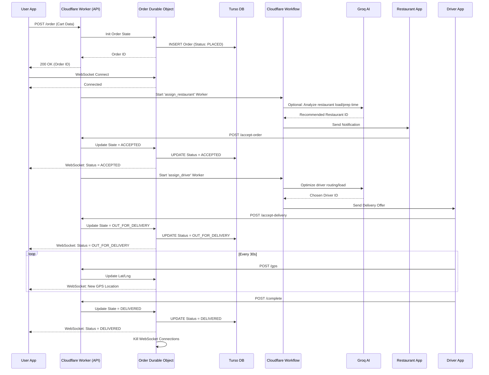

# TAR Commerce System: Agentic Architecture Plan

This document outlines the technical architecture for the generalized TAR Commerce System, leveraging Cloudflare's edge infrastructure and Turso for database state mapping.

## 1. System Components

- **Cloudflare Workers:** The core API endpoints and event handlers. They act as the initial gateway for user requests, incoming webhooks (WhatsApp, Telegram, Stripe), and CRON triggers.
- **Durable Objects (DO):** The "AgentBrain" for stateful entities. Each active Order, Active Delivery Driver, or Active Support Chat gets its own DO. This ensures strict consistency and in-memory speed for fast-changing state.
- **WebSockets:** Managed by Durable Objects to provide real-time updates to connected clients (e.g., live GPS tracking, fast order status changes) without constant polling.
- **Cloudflare Workflows:** For reliable, multi-step asynchronous processes that might fail or need retries (e.g., "Assign Driver" -> Wait for response -> "Reassign if timeout" -> "Notify Restaurant").
- **Cloudflare Queues:** For high-volume, fire-and-forget events (e.g., logging analytics, batching AI sentiment analysis of feedback).
- **Groq AI / External LLMs:** The intelligence layer. Called selectively for complex decision-making, natural language parsing, and optimization, but avoided for simple deterministic state transitions to save costs.
- **Turso (SQLite Edge DB):** The persistent, globally distributed source of truth. Maps directly to the TAR State/Instance/Trace model.

## 2. TAR Data Model Mapping to Infrastructure

The TAR (Trace, Action, Resource) model maps cleanly to this infrastructure:

- **State (The "What"):** Stored persistently in Turso. Claimed transiently in memory by a Durable Object when active.
- **Instance (The "Who/Which"):** A specific Durable Object instance (e.g., `OrderDO_ID_12345`).
- **Trace (The "History"):** Logged via Cloudflare Queues and slowly synced to Turso, or written directly to Turso during crucial state transitions by the DO or Workflow.

## 3. Sequence Diagram: End-to-End Food Order

## 4. Hybrid Cloudflare + Turso Architecture

This architecture balances the extreme speed of Cloudflare's edge with the relational querying power of Turso.

1.  **Read-Heavy Paths (e.g., browsing menus, viewing history):**
    - User -> Worker -> Turso (Edge Read Replica) -> User
    - _Result:_ Single-digit millisecond latency worldwide. Extremely cheap.
2.  **Highly Active State Paths (e.g., active order tracking, live chat):**
    - User -> Worker -> Durable Object -> User
    - The DO acts as a cache and coordinator. It occasionally writes essential state changes back to Turso.
    - _Result:_ Real-time coordination and concurrency control without hammering the database with writes every 5 seconds (e.g., for GPS tracking).
3.  **Background Processing Paths (e.g., analytics, complex assignments):**
    - Worker -> Queue/Workflow -> Turso (Primary Write)
    - _Result:_ Reliable execution that doesn't block the user's HTTP request.

## 5. Cost Optimization Strategy (Reducing AI Cost by 70%)

To keep costs low (aiming for the ₹0.15 - ₹0.25 range per transaction), AI must be used aggressively _only_ where it adds value, and completely avoided elsewhere.

**DO NOT use AI for:**

- Deterministically changing state (e.g., `if driver = at_location, status = arrived`). Write standard code for this.
- Formatting data for the UI.
- Basic data validation.

**DO use AI for (The 30% that matters):**

1.  **Natural Language Ingestion (The "Webhook Adapter"):**
    - Use Groq (fast, cheap) to transpile a chaotic WhatsApp message ("Hey I need 2 vegan burgers delivered to 123 Main St in an hour") into a clean JSON API payload.
    - _Cost Savings:_ Use small, specialized models (e.g., Llama 3 8B on Groq) instead of GPT-4o for these simple extraction tasks.
2.  **Complex Optimization (Driver/Restaurant Assignment):**
    - Pass the "state of the network" to the LLM: "Restaurant A has 15 pending orders. Restaurant B has 2. Driver 1 is 5 mins away but carrying another order. Who gets this new order?"
    - _Cost Savings:_ Cache the context. Don't query the entire database; only pass the relevant slice of active data to the LLM.
3.  **Exception Handling & Sentiment Decalation:**
    - If a user complains about cold food, use an LLM to determine the sentiment, apologize appropriately, and determine a refund amount based on rules you provide.
    - _Cost Savings:_ Use a local/edge-deployed smaller model or a very cheap Groq tier for initial triage, only escalating to expensive models for edge cases.
