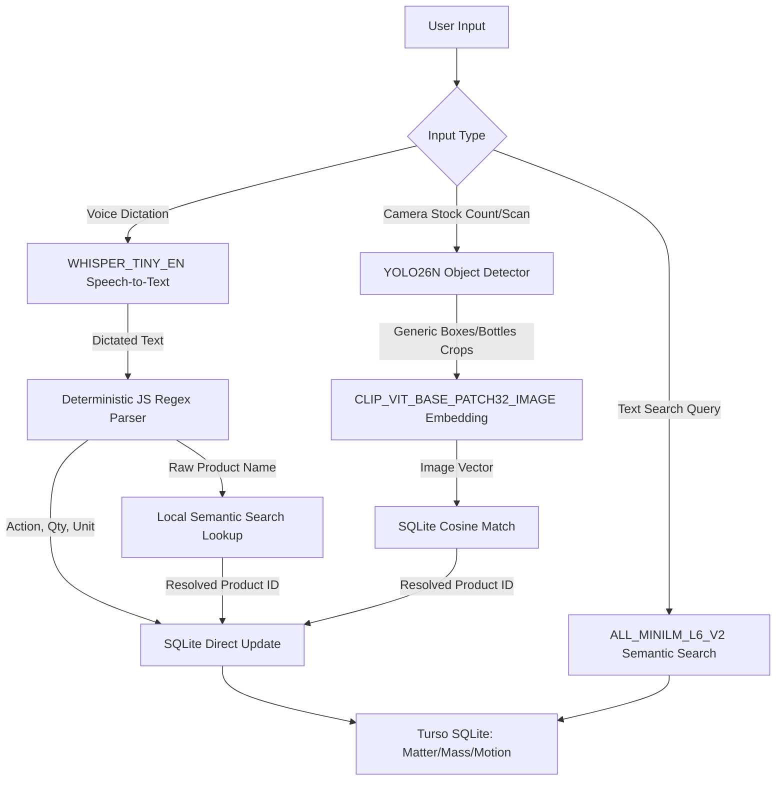

# Strategic Roadmap: On-Device AI for Budget Devices (English Focus)

This plan outlines the architecture for deploying on-device AI capabilities using ExecuTorch in the TAR mobile application. It is optimized for phones in the ₹10,000–15,000 range (typically featuring 6 GB to 8 GB RAM and processors like the MediaTek Dimensity 6100+/7020) by keeping the memory footprint low and relying on a hybrid online/offline system.

---

## Strategic Shift

> [!IMPORTANT]
> **No On-Device LLM (Llama 3.2 1B)**
> - To avoid Out-of-Memory (OOM) app crashes on budget devices and conserve battery life, **we are not running an on-device LLM**.
> - Instead, we use a hybrid model: **Cloud LLM (Groq)** when online, and a **Deterministic JS Parser + Local Semantic Lookup** for offline scenarios.

> [!NOTE]
> **English First, Tamil Next Year**
> - Phase 1 will focus exclusively on English dictation and search.
> - Phase 2 (next year) will introduce multilingual models (Whisper Multilingual & Multilingual Embeddings) to support native Tamil voice commands and searches.

---

## Proposed AI Model Architecture



### Model Suitability for ₹10k–15k Devices

| Model | Size | Active RAM | Role | Suitability |
| :--- | :--- | :--- | :--- | :--- |
| **`ALL_MINILM_L6_V2`** | 91 MB | ~95 MB | Local semantic search | **Perfect** (Runs instantly) |
| **`WHISPER_TINY_EN`** | 151 MB | ~375 MB | Local English speech-to-text | **Excellent** (No lag, offline input) |
| **`YOLO26N (Nano)`** | 10.3 MB | ~40 MB | Detect bounding boxes of items | **Perfect** (Real-time live scan) |
| **`CLIP_VIT_BASE_PATCH32_IMAGE (INT8)`** | 96.4 MB | ~340 MB | Generate image vectors for crops | **Excellent** (Fast comparison) |

---

## Technical Integration Plan

### Phase 1: English Capabilities & Visual Search (Current)

#### 1. Local Semantic Search (Completed)
* Currently active using `ALL_MINILM_L6_V2`.
* Automatically indexes records on mutations (add/edit/delete) and serves search results ranked by similarity score.

#### 2. Deterministic Voice Dictation & Stock Updates (Next)
* **Goal**: Enable offline stock additions/removals via speech (e.g. *"add stock onion 2 kg"*) without needing an LLM.
* **Pipeline Flow**:
  1. **Transcription**: Local `WHISPER_TINY_EN` generates the text string.
  2. **Regex Parsing**: A standard JS script parses the string to extract:
     - **Verb/Action**: e.g., `"add"` $\rightarrow$ Addition.
     - **Quantity & Unit**: e.g., `"2"` and `"kg"`.
     - **Product Substring**: e.g., `"onion"`.
  3. **ID Resolution**: The product substring (`"onion"`) is sent to the local semantic search index. It resolves the closest database record (e.g., `matter_id = 'mat_onion_123'`).
  4. **Database Execution**: Directly runs SQL updates:
     ```sql
     UPDATE mass SET qty = qty + 2 WHERE matter = 'mat_onion_123';
     ```

#### 3. Visual Product Identification & Counting Pipeline (New)
* **Goal**: Detect and identify products in a grocery/retail setting even if they are not pre-trained in standard AI classes.
* **Implementation Flow**:
  1. **Detection**: Use **YOLO26N** to locate generic objects (e.g. `box`, `bottle`, `can`, `packet`) and crop them.
  2. **Embedding**: Pass each cropped item image to the **CLIP Image Encoder (INT8)** to generate a 512-dimension visual embedding.
  3. **Visual Vector Search**: Match the generated embedding against registered product vectors inside the SQLite database using cosine similarity.
  4. **Output**: Automatically count quantities and update inventory lists without manual input.

---

## Verification Plan

### Automated Tests
- Verification scripts to measure inference latency of YOLO26N + CLIP on budget devices.
- Accuracy checks matching cropped images of products against registered database vector reference samples.

### Manual Verification
- Testing voice transcription accuracy under noisy environment conditions.
- Verifying bounding box accuracy on physical goods shelves under varied lighting.
