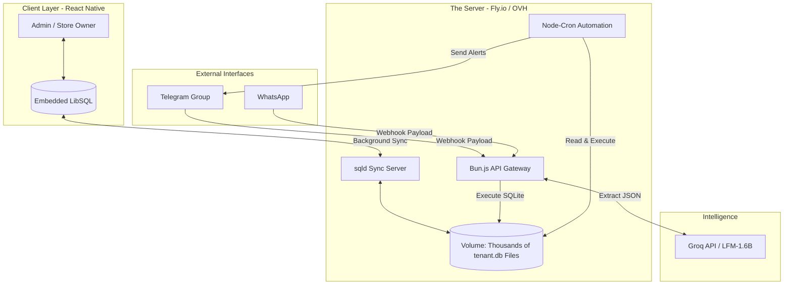

# The Universal Monolith Architecture

**Version 2.0** · **Target: 1,000,000 Users**

---

## 1. Vision & Core Principles

> The `tar` backend is designed to achieve maximum scale at extreme minimum cost.
> We abandoned complex, bloated Agent frameworks. Instead, we use a **Custom Bun.js API Gateway**
> that directly reads and writes to thousands of isolated SQLite databases.

| # | Principle | Description |
|:--|:----------|:------------|
| 1 | **Local-First, Cloud-Synced** | The app works offline and syncs natively to the VPS in the background. |
| 2 | **One Monolithic Server** | A single Bun.js process dynamically routes traffic to thousands of local `tenant_id.db` files. |
| 3 | **Parse Once, Execute Directly** | AI is a parser. Groq turns language into JSON; Bun executes the SQL. |
| 4 | **Scale with Activity, Not Users** | Idle tenants cost zero RAM. 3,000 active tenants on a $15 machine — no Docker per tenant. |

---

## 2. Infrastructure Diagram

```text
+-------------------------------+       +---------------------------+
|  CLIENT LAYER (React Native)  |       |  EXTERNAL INTERFACES      |
|                               |       |                           |
|  Admin / Store Owner          |       |  Telegram Group           |
|        |                      |       |  WhatsApp                 |
|  +------------------+         |       +------------+--------------+
|  | Embedded LibSQL  |         |                    |
|  +--------+---------+         |                    | Webhook Payload
+-----------|-----------------+                    |
            |                                       |
            | Background Sync                       |
            v                                       v
+=============================================================+
||              THE SERVER (Fly.io / OVH)                     ||
||                                                            ||
||  +-------------------+    +---------------------+          ||
||  | sqld Sync Server  |    | Bun.js API Gateway  |<-----+   ||
||  +--------+----------+    +----------+----------+      |   ||
||           |                          |            Extract   ||
||           |               +----------+----------+  JSON    ||
||           |               |  Node-Cron          |      |   ||
||           |               |  Automation         |  +---+------+
||           |               +----------+----------+  | Groq API |
||           |                          |             | LFM-1.6B |
||           v                          v             +----------+
||  +-----------------------------------------------------+   ||
||  |  VOLUME: Thousands of tenant.db Files                |   ||
||  +-----------------------------------------------------+   ||
+=============================================================+
```



---

## 3. The Tech Stack

| Layer | Component | Technology | Primary Role |
|:------|:----------|:-----------|:-------------|
| Client | Mobile App | Expo (RN) + LibSQL | Local-first data entry, offline-capable admin panel |
| Gateway | The Brain | Bun.js (TypeScript) | Fast HTTP server: webhooks, routing, AI calls |
| Sync | The Router | `sqld` (Turso) | Syncs local SQLite files to mobile apps effortlessly |
| Storage | The Vault | Persistent Volume | Tiny `tenant.db` files on a cheap, massive SSD |
| AI | The Parser | Groq / LFM-1.6B | Parses natural language into structured JSON instantly |
| Interface | The Face | Telegram / WhatsApp | Conversational layers talking to the Bun Webhook |

---

## 4. The "Bring Your Own Interface" (BYOI) Model

> Building real-time sockets, typing indicators, and message histories inside custom apps
> is a massive waste of resources. Instead, we use a **BYOI model** — delegate chat to
> platforms that already perfected it.

| Channel | Purpose | Users | Interface Style |
|:--------|:--------|:------|:----------------|
| `tar` Mobile App | Admin & Business Management | Store Owners, Managers | Structured UI, Charts, Catalog |
| Telegram / WhatsApp | Operational Commands & Alerts | Staff, Drivers, Vendors | Natural Language, Chat-based |
