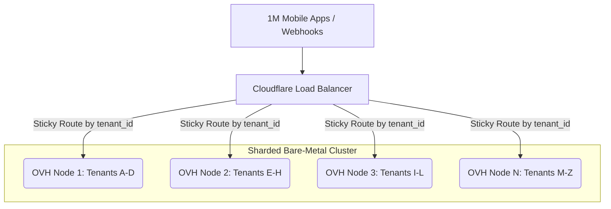

# Hosting, Cost & Capacity Modeling

*Proving the path from $15/month to 1,000,000 users.*

---

## 1. The Mathematical Challenge — Why SQLite?

> **The Problem with Docker-per-Tenant:**
> Running Application Containers per-tenant costs ~50MB RAM + background CPU **per tenant**.
> At 10,000 tenants, that is **500 GB RAM** just to idle. This destroys SaaS unit economics.

| Approach | 10,000 Tenants | Idle RAM Cost |
|:---------|:---------------|:--------------|
| Docker per Tenant | 10,000 x 50MB | 500 GB — ~$2,000+/mo |
| SQLite Scale-to-Zero | 10,000 x 0MB idle | 0 GB — ~$15/mo |

> **The Solution: SQLite Scale-to-Zero.**
> Bun dynamically opens `.db` files only at the exact millisecond a webhook hits.
> Idle tenants consume **0 RAM** and **0 vCPUs**.

---

## 2. Hardware Capacity — The Launch Phase

**Target Machine:** Fly.io Shared CPU 2x

| Spec | Value |
|:-----|:------|
| Machine | Fly.io Shared CPU 2x |
| RAM | 4 GB |
| Storage | 50 GB Persistent Volume |
| Cost | ~$15/month |

### Capacity Limits

| Constraint | Calculation | Maximum Capacity |
|:-----------|:-----------|:-----------------|
| Storage Limit | 50 GB / ~10 MB per active store per year | ~5,000 total DB files |
| RAM Limit | (4 GB - 1 GB OS) / 1.5 MB per active hit | ~2,000 concurrent ops |
| CPU Limit | Groq handles AI; Bun only routes | Thousands of req/sec |

> **Launch Verdict:**
> A $15/month Fly.io machine comfortably supports **1,500 highly active, paying store owners**.

---

## 3. The Enterprise Phase — 1M User Sharding

> When you outgrow Fly.io or surpass 10,000 concurrent users, migrate the Monolith
> onto extremely cheap, massive **Bare-Metal OVH Machines**.

### Enterprise Machine Spec

| Spec | Value |
|:-----|:------|
| Machine | OVH VPS 6 |
| CPU | 16 vCores |
| RAM | 64 GB |
| Storage | 500 GB SSD |
| Cost | ~$50/month |

### The 1M User Sharding Flow

```text
                    +------------------------+
                    |     1M Mobile Apps      |
                    |       / Webhooks        |
                    +-----------+------------+
                                |
                                v
                    +------------------------+
                    |    Cloudflare Load      |
                    |      Balancer           |
                    +---+----+----+----+-----+
                        |    |    |    |
         Sticky Route   |    |    |    |   by tenant_id
     +------------------+    |    |    +------------------+
     |              +--------+    +--------+              |
     v              v                      v              v
+-----------+  +-----------+  +-----------+  +-----------+
| OVH       |  | OVH       |  | OVH       |  | OVH       |
| Node 1    |  | Node 2    |  | Node 3    |  | Node N    |
| Tenants   |  | Tenants   |  | Tenants   |  | Tenants   |
| A - D     |  | E - H     |  | I - L     |  | M - Z     |
| [.db][.db]|  | [.db][.db]|  | [.db][.db]|  | [.db][.db]|
+-----------+  +-----------+  +-----------+  +-----------+
```



### The Enterprise Math

| Step | Action |
|:-----|:-------|
| 1 | Rent **20** Bare-Metal OVH Machines. Infra bill: ~$1,000/month |
| 2 | Deploy the exact same Bun Server + `sqld` onto all 20 machines |
| 3 | Cloudflare routes requests to the specific server holding the user's `[tenant].db` file |

| Metric | Value |
|:-------|:------|
| Cost per user | $0.001 |
| Gross margins | 99.8% |
| Total infra bill | ~$1,000/mo for 1M users |

### Scaling Roadmap

| Phase | Users | Machines | Monthly Cost | Cost per User |
|:------|------:|:---------|:-------------|:--------------|
| Launch | 1,500 | 1x Fly.io | $15 | $0.010 |
| Growth | 50,000 | 1x OVH VPS 6 | $50 | $0.001 |
| Enterprise | 1,000,000 | 20x OVH VPS 6 | $1,000 | $0.001 |
