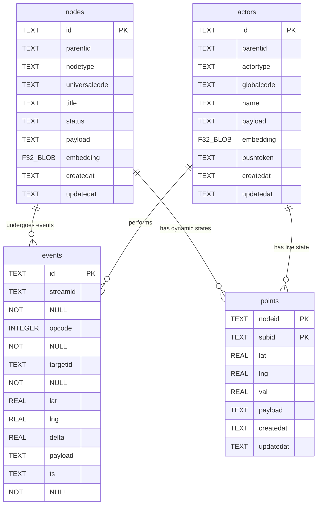

# The Universal Schema

4 tables per tenant. 2 tables global. Zero bloat.

---

## Part A: Private Tenant DB

Every tenant receives their own isolated SQLite file (`/tenants/{id}.db`).
Only `published` nodes sync to the Public DB for global discovery.

---

### 1. Entity Relationship Diagram

### Relationship Summary

| From     | To       | Relationship                  |
| :------- | :------- | :---------------------------- |
| `nodes`  | `events` | A node undergoes many events  |
| `actors` | `events` | An actor performs many events |
| `nodes`  | `points` | A node has dynamic sub-states |
| `actors` | `points` | An actor has live state       |

---

### 2. Table: `nodes`

Permanent entities: products, variants, orders, collections, services, rentals, stores.

**Schema:**

| Column          | Type | Key | Description                                         |
| :-------------- | :--- | :-- | :-------------------------------------------------- |
| `id`            | TEXT | PK  | Unique ID, e.g. `prod-123`, `ord-456`               |
| `parentid`      | TEXT | FK  | Hierarchical links (e.g. variants to products)      |
| `nodetype`      | TEXT |     | Categorization: `product`, `variant`, `order`       |
| `universalcode` | TEXT |     | Barcode / QR code identifier                        |
| `title`         | TEXT |     | Human-readable name                                 |
| `status`        | TEXT |     | Visibility: `published`, `draft`, `archived`        |
| `payload`       | TEXT |     | JSON for all dynamic attributes (price, desc, etc.) |
| `embedding`     | F32  |     | 384-dim vector for semantic search                  |
| `createdat`     | TEXT |     | ISO 8601 creation timestamp                         |
| `updatedat`     | TEXT |     | ISO 8601 last update timestamp                      |

**Example Data:**

| id          | parentid   | nodetype | title              | status    | payload                                              | createdat            |
| :---------- | :--------- | :------- | :----------------- | :-------- | :--------------------------------------------------- | :------------------- |
| `prod-001`  | `null`     | product  | Classic Book       | published | `{"price": 12.99, "author": "John Doe"}`             | 2026-02-20T10:00:00Z |
| `prod-002`  | `null`     | product  | Basic T-Shirt      | published | `{"brand": "Tar", "desc": "100% Cotton"}`            | 2026-02-20T11:00:00Z |
| `var-ts-sm` | `prod-002` | variant  | Small Blue T-Shirt | published | `{"size": "Small", "color": "Blue", "price": 19.99}` | 2026-02-20T11:05:00Z |
| `var-ts-lg` | `prod-002` | variant  | Large Red T-Shirt  | draft     | `{"size": "Large", "color": "Red", "price": 21.99}`  | 2026-02-20T11:05:00Z |
| `ord-789`   | `null`     | order    | Table 4 Order      | draft     | `{"notes": "No onions", "total": 32.98}`             | 2026-02-20T14:35:00Z |
| `srv-11`    | `null`     | service  | Pipe Repair        | published | `{"price": 150, "durationmins": 60}`                 | 2026-02-20T09:00:00Z |
| `prop-09`   | `null`     | rental   | Downtown Loft      | published | `{"pricepernight": 200, "bedrooms": 2}`              | 2026-02-20T09:30:00Z |

---

### 3. Table: `actors`

People and systems interacting with the tenant database.

**Schema:**

| Column       | Type | Key | Description                                      |
| :----------- | :--- | :-- | :----------------------------------------------- |
| `id`         | TEXT | PK  | Unique ID, e.g. `John`, `System`                 |
| `parentid`   | TEXT | FK  | Group or hierarchy association                   |
| `actortype`  | TEXT |     | Determines behavior: `merchant`, `driver`, `bot` |
| `globalcode` | TEXT |     | Universal cross-tenant identifier                |
| `name`       | TEXT |     | Human-readable name                              |
| `payload`    | TEXT |     | JSON (preferences, stats, overrides)             |
| `embedding`  | F32  |     | 384-dim vector for semantic search               |
| `pushtoken`  | TEXT |     | Expo Push Token for mobile alerts                |
| `createdat`  | TEXT |     | ISO 8601 creation timestamp                      |
| `updatedat`  | TEXT |     | ISO 8601 last update timestamp                   |

**Example Data:**

| id            | parentid   | actortype | name            | pushtoken         | createdat            |
| :------------ | :--------- | :-------- | :-------------- | :---------------- | :------------------- |
| `John`        | `null`     | merchant  | John Doe        | `ExponentPush...` | 2026-02-01T10:00:00Z |
| `Driver-Mike` | `fleet-01` | driver    | Michael         | `ExponentPush...` | 2026-02-15T08:30:00Z |
| `System`      | `null`     | system    | Tar Bot         | `null`            | 2026-01-01T00:00:00Z |
| `POS-Term-1`  | `null`     | terminal  | Front Desk iPad | `null`            | 2026-02-10T11:00:00Z |

---

### 4. Table: `points`

High-frequency dynamic state cache. Handles variant stock, live GPS, surge pricing, ratings — anything that updates rapidly without bloating the event ledger or reserializing JSON payloads.

**Schema:**

| Column      | Type | Key    | Description                                                  |
| :---------- | :--- | :----- | :----------------------------------------------------------- |
| `nodeid`    | TEXT | PK, FK | Master node/actor ID (e.g., `prod-002`, `Driver-Mike`)       |
| `subid`     | TEXT | PK     | Sub-identifier (e.g., `var-sm`, `motion`, `surge`)           |
| `lat`       | REAL |        | Live GPS latitude                                            |
| `lng`       | REAL |        | Live GPS longitude                                           |
| `val`       | REAL |        | Numeric value (stock count, price, surge multiplier, rating) |
| `payload`   | TEXT |        | JSON for additional sub-state attributes                     |
| `createdat` | TEXT |        | ISO 8601 creation timestamp                                  |
| `updatedat` | TEXT |        | ISO 8601 last update timestamp (staleness check)             |

**Example Data:**

| nodeid        | subid    | lat     | lng     |    val | updatedat            | Scenario                        |
| :------------ | :------- | :------ | :------ | -----: | :------------------- | :------------------------------ |
| `prod-002`    | `var-sm` | `null`  | `null`  |    150 | 2026-02-20T14:35:00Z | Variant stock count             |
| `prod-002`    | `var-lg` | `null`  | `null`  |     10 | 2026-02-20T14:35:00Z | Variant stock count             |
| `Driver-Mike` | `motion` | 25.2048 | 55.2708 | `null` | 2026-02-20T14:45:00Z | Live GPS ping (overwriting)     |
| `srv-11`      | `rating` | `null`  | `null`  |    4.8 | 2026-02-20T15:00:00Z | Live average rating             |
| `prop-09`     | `avail`  | `null`  | `null`  |      1 | 2026-02-20T15:00:00Z | Availability (1=open, 0=booked) |

---

### 5. Table: `events`

The universal event-sourced ledger. Immutable, append-only.
_Note: Once an event set for a specific `streamid` is considered historically complete (e.g. an order is fulfilled and closed), it is purged from the hot SQLite database and archived to deep storage (S3/R2) to keep the tenant DB ultra-lean._

**Schema:**

| Column     | Type    | Key | Description                                          |
| :--------- | :------ | :-- | :--------------------------------------------------- |
| `id`       | TEXT    | PK  | Unique event ID                                      |
| `streamid` | TEXT    | FK  | Which business stream this event belongs to          |
| `opcode`   | INTEGER |     | Defines exactly what happened (see Opcode Map below) |
| `targetid` | TEXT    | FK  | What entity this affected                            |
| `lat`      | REAL    |     | Point-in-time GPS snapshot                           |
| `lng`      | REAL    |     | Point-in-time GPS snapshot                           |
| `delta`    | REAL    |     | Quantitative change (stock +/-, price adjustment)    |
| `payload`  | TEXT    |     | JSON parameters specific to this event               |
| `ts`       | TEXT    |     | ISO 8601 event timestamp                             |

**Example Data:**

| id        | streamid  | targetid      | opcode | lat     | lng     | delta | payload                 | ts                   | Scenario                    |
| :-------- | :-------- | :------------ | -----: | :------ | :------ | ----: | :---------------------- | :------------------- | :-------------------------- |
| `evt-001` | `sys-inv` | `prod-001`    |    101 | 25.1972 | 55.2744 |   +50 | `{"supplier": "X"}`     | 2026-02-19T08:00:00Z | Stock In at warehouse       |
| `evt-002` | `sys-inv` | `var-ts-sm`   |    104 | 25.1972 | 55.2744 |    -5 | `{"reason": "Damaged"}` | 2026-02-19T08:05:00Z | Stock Adjust (damaged)      |
| `evt-003` | `ord-789` | `John`        |    501 | `null`  | `null`  |     0 | `{"channel": "web"}`    | 2026-02-20T14:30:00Z | Order Created               |
| `evt-004` | `ord-789` | `var-ts-sm`   |    102 | `null`  | `null`  |    -2 | `{"pricepaid": 39.98}`  | 2026-02-20T14:31:00Z | Sale Out (inventory deduct) |
| `evt-005` | `ord-789` | `System`      |    203 | `null`  | `null`  |     0 | `{"stripeid": "ch_"}`   | 2026-02-20T14:32:00Z | Invoice Payment             |
| `evt-006` | `ord-789` | `Driver-Mike` |    302 | `null`  | `null`  |     0 | `{"vehicle": "Bike"}`   | 2026-02-20T14:40:00Z | Task Assign (driver)        |
| `evt-007` | `ord-789` | `Driver-Mike` |    503 | 25.2100 | 55.2800 |     0 | `{"signature": "pdf"}`  | 2026-02-20T15:00:00Z | Order Delivered             |

---

## Part B: Public DB

A single centralized database powering global search, discovery, and AI queries across all tenants.

---

### 6. Table: `publicnodes`

All published listings from all tenants merged into one searchable table. Purely static — only updates when a merchant changes their title or description. Optimized for FTS5 indexing.

**Schema:**

| Column     | Type | Key    | Description                                   |
| :--------- | :--- | :----- | :-------------------------------------------- |
| `tenantid` | TEXT | PK, FK | The tenant who owns this listing              |
| `id`       | TEXT | PK     | The original node/actor ID from the tenant DB |
| `payload`  | TEXT |        | FTS indexable JSON (title, type, price, etc.) |

**Example Data:**

| tenantid   | id            | payload                                                              | Scenario              |
| :--------- | :------------ | :------------------------------------------------------------------- | :-------------------- |
| `store-hq` | `prod-001`    | `{"type": "product", "title": "Classic Book", "price": 12.99}`       | Product               |
| `store-hq` | `var-ts-sm`   | `{"type": "variant", "title": "Small Blue T-Shirt", "price": 19.99}` | Flattened Variant     |
| `uber-ind` | `Driver-Mike` | `{"type": "actor", "title": "Michael S.", "actortype": "driver"}`    | Actor as Listing      |
| `plumb-co` | `srv-11`      | `{"type": "service", "title": "Pipe Repair", "price": 150}`          | Professional Service  |
| `bnb-host` | `prop-09`     | `{"type": "rental", "title": "Downtown Loft", "pricepernight": 200}` | Real Estate / Booking |
| `store-hq` | `store-hq`    | `{"type": "store", "title": "HQ Bookstore"}`                         | Store Itself          |

---

### 7. Table: `publicpoints`

All dynamic state for public listings. Location, stock, ratings, availability — everything that changes frequently lives here. `publicnodes` never gets touched by high-frequency updates.

**Schema:**

| Column     | Type | Key    | Description                                        |
| :--------- | :--- | :----- | :------------------------------------------------- |
| `tenantid` | TEXT | PK, FK | The tenant who owns this listing                   |
| `nodeid`   | TEXT | PK, FK | Which publicnode this sub-state belongs to         |
| `subid`    | TEXT | PK     | Sub-identifier (e.g., `loc`, `stock`, `motion`)    |
| `lat`      | REAL |        | GPS latitude                                       |
| `lng`      | REAL |        | GPS longitude                                      |
| `val`      | REAL |        | Numeric value (stock, price, rating, availability) |

**Example Data:**

| tenantid   | nodeid        | subid    | lat     | lng     |    val | Scenario                        |
| :--------- | :------------ | :------- | :------ | :------ | -----: | :------------------------------ |
| `store-hq` | `prod-001`    | `loc`    | 25.1972 | 55.2744 | `null` | Store location (static)         |
| `store-hq` | `prod-001`    | `stock`  | `null`  | `null`  |     50 | Product stock count             |
| `store-hq` | `prod-002`    | `loc`    | 25.1972 | 55.2744 | `null` | Store location (static)         |
| `store-hq` | `prod-002`    | `var-sm` | `null`  | `null`  |    150 | Variant stock count             |
| `store-hq` | `prod-002`    | `var-lg` | `null`  | `null`  |     10 | Variant stock count             |
| `uber-ind` | `Driver-Mike` | `loc`    | 25.2048 | 55.2708 | `null` | Live driver GPS (updates often) |
| `plumb-co` | `srv-11`      | `loc`    | 25.2100 | 55.2800 | `null` | Plumber location                |
| `plumb-co` | `srv-11`      | `rating` | `null`  | `null`  |    4.8 | Live rating                     |
| `bnb-host` | `prop-09`     | `loc`    | 25.1900 | 55.2600 | `null` | Property location               |
| `bnb-host` | `prop-09`     | `avail`  | `null`  | `null`  |      1 | Availability (1=open, 0=booked) |
| `store-hq` | `store-hq`    | `loc`    | 25.1972 | 55.2744 | `null` | Store location                  |

---

## Part C: The Universal Opcode Map

Integer-based opcodes for blindingly fast `events` indexing.

### Opcode Categories

| Range | Category                        |
| :---- | :------------------------------ |
| 1xx   | 🧱 Stock                        |
| 2xx   | 🧾 Invoice / Billing            |
| 3xx   | 🧑‍💼 Tasks / Workflow             |
| 4xx   | 💰 Accounts / Ledger            |
| 5xx   | 🚚 Orders / Delivery            |
| 6xx   | 🚕 Transport / Booking / Rental |
| 7xx   | 🏛 Tax / Government             |
| 8xx   | 🧠 Memory / AI                  |
| 9xx   | 🔐 Identity / ACL               |

### Full Opcode Reference

**🧱 Stock (1xx)**
| Code | Name | Description |
| ---: | :--- | :--- |
| 101 | STOCKIN | Stock In |
| 102 | SALEOUT | Sale Out |
| 103 | SALERETURN | Sale Return |
| 104 | STOCKADJUST | Stock Adjust |
| 105 | STOCKTRANSFEROUT | Stock Transfer Out |
| 106 | STOCKTRANSFERIN | Stock Transfer In |
| 107 | STOCKVOID | Stock Void |

**🧾 Invoice / Billing (2xx)**
| Code | Name | Description |
| ---: | :--- | :--- |
| 201 | INVOICECREATE | Invoice Create |
| 202 | INVOICEITEMADD | Invoice Item Add |
| 203 | INVOICEPAYMENT | Invoice Payment |
| 204 | INVOICEPAYMENTFAIL | Invoice Payment Fail |
| 205 | INVOICEVOID | Invoice Void |
| 206 | INVOICEITEMDEFINE | Invoice Item Define |
| 207 | INVOICEREFUND | Invoice Refund |

**🧑‍💼 Tasks / Workflow (3xx)**
| Code | Name | Description |
| ---: | :--- | :--- |
| 301 | TASKCREATE | Task Create |
| 302 | TASKASSIGN | Task Assign |
| 303 | TASKSTART | Task Start |
| 304 | TASKPROGRESS | Task Progress |
| 305 | TASKDONE | Task Done |
| 306 | TASKFAIL | Task Fail |
| 307 | TASKBLOCK | Task Block |
| 308 | TASKRESUME | Task Resume |
| 309 | TASKVOID | Task Void |
| 310 | TASKLINK | Task Link |
| 311 | TASKCOMMENT | Task Comment |

**💰 Accounts / Ledger (4xx)**
| Code | Name | Description |
| ---: | :--- | :--- |
| 401 | ACCOUNTPAYIN | Account Pay In |
| 402 | ACCOUNTPAYOUT | Account Pay Out |
| 403 | ACCOUNTREFUND | Account Refund |
| 404 | ACCOUNTADJUST | Account Adjust |

**🚚 Orders / Delivery (5xx)**
| Code | Name | Description |
| ---: | :--- | :--- |
| 501 | ORDERCREATE | Order Create |
| 502 | ORDERSHIP | Order Ship |
| 503 | ORDERDELIVER | Order Deliver |
| 504 | ORDERCANCEL | Order Cancel |

**🚕 Transport / Booking / Rental (6xx)**
| Code | Name | Description |
| ---: | :--- | :--- |
| 601 | RIDECREATE | Ride Create |
| 602 | RIDESTART | Ride Start |
| 603 | RIDEDONE | Ride Done |
| 604 | RIDECANCEL | Ride Cancel |
| 605 | MOTION | Driver or asset live location ping |
| 611 | BOOKINGCREATE | Booking Create |
| 612 | BOOKINGDONE | Booking Done |
| 621 | RENTALSTART | Rental Start |
| 622 | RENTALEND | Rental End |

**🏛 Tax / Government (7xx)**
| Code | Name | Description |
| ---: | :--- | :--- |
| 701 | GSTVATACCRUE | GST/VAT Accrue |
| 702 | GSTVATPAY | GST/VAT Pay |
| 703 | GSTVATREFUND | GST/VAT Refund |

**🧠 Memory / AI (8xx)**
| Code | Name | Description |
| ---: | :--- | :--- |
| 801 | MEMORYDEFINE | Memory Define |
| 802 | MEMORYWRITE | Memory Write |
| 803 | MEMORYUPDATE | Memory Update |
| 804 | MEMORYSNAPSHOT | Memory Snapshot |

**🔐 Identity / ACL (9xx)**
| Code | Name | Description |
| ---: | :--- | :--- |
| 901 | USERCREATE | User Create |
| 902 | USERROLEGRANT | User Role Grant |
| 903 | USERAUTH | User Auth |
| 904 | USERDISABLE | User Disable |
