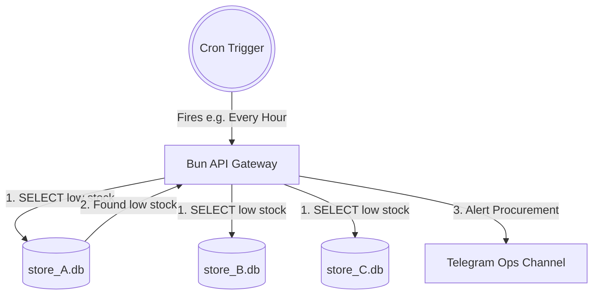

# Automated Commerce Tasks (Cron)

*Scheduled SQL queries against isolated data — no AI agents, no polling.*

---

> In massive multi-tenant systems, "Agent Automation" is just scheduled SQL queries
> executed against isolated data. By utilizing the `orevents` Universal Ledger, we do **not** need
> AI to "monitor streams" via expensive polling.

Information is perfectly indexed chronologically, allowing **Bun.js** to act as the massive
commerce orchestrator via `node-cron`.

---

## 1. Execution Model

```text
                      +---------------+
                      |  CRON         |
                      |  TRIGGER      |
                      +-------+-------+
                              |
                   Fires (e.g. Every Hour)
                              |
                              v
                    +-------------------+
                    |  Bun.js API       |
                    |  Gateway          |
                    +--+--------+--+---+
                       |        |  |
          +------------+        |  +------------+
          v                     v               v
  +-------------+     +-------------+    +-------------+
  | store_A.db  |     | store_B.db  |    | store_C.db  |
  +------+------+     +-------------+    +-------------+
         |
    Found issues?
         | YES
         v
  +-------------------------+
  | Telegram Ops Channel    |
  | "3 orders stuck!"       |
  +-------------------------+
```



---

## 2. Core Task Implementations

### Task Overview

| # | Task | Schedule | Opcode(s) | Alert Channel |
|:--|:-----|:---------|:----------|:--------------|
| 1 | Stuck Order Monitor | Every hour | `500` (PROCESSING) | Telegram |
| 2 | Low Stock Alert | Every 4 hours | reads `nodes` table | Telegram |
| 3 | Abandoned Checkout | Every hour | `101` / `201` | WhatsApp or Telegram |

---

### Task 1: The "Stuck Order" Monitor

> **Requirement:** Find order streams stuck in PROCESSING for more than 36 hours
> and suggest next action.

**Pipeline:**

| Step | Action |
|:-----|:-------|
| 1 | Cron fires every hour |
| 2 | Query each tenant.db for orders with last opcode = 500 |
| 3 | Filter for orders with no activity in 36+ hours |
| 4 | Send alert to Telegram Ops Group |

```typescript
// Run every hour
cron.schedule("0 * * * *", async () => {
  for (const tenantDb of allTenantDatabases) {
    // 500 = PROCESSING Opcode
    const stuckOrders = tenantDb
      .query(
        `
      SELECT nodeid FROM orevents 
      WHERE nodeid LIKE 'ord-%'
      GROUP BY nodeid
      HAVING MAX(created_at) < datetime('now', '-36 hours')
      AND (SELECT opcode FROM orevents o2 WHERE o2.nodeid = orevents.nodeid ORDER BY created_at DESC LIMIT 1) = 500
    `,
      )
      .all();

    if (stuckOrders.length > 0) {
      await telegram.sendMessage(
        tenantGroupId,
        `${stuckOrders.length} orders stuck in preparation!`,
      );
    }
  }
});
```

<details>
<summary>SQL Breakdown</summary>

| Clause | Purpose |
|:-------|:--------|
| `WHERE nodeid LIKE 'ord-%'` | Only look at order-type events |
| `GROUP BY nodeid` | Group all events per order |
| `HAVING MAX(created_at) < datetime(...)` | No activity in 36+ hours |
| `AND ... opcode = 500` | Last known status is still PROCESSING |

</details>

---

### Task 2: Supply Chain / Low Stock Alert

> **Requirement:** Every 4 hours, scan inventory. If any SKU is below safety threshold,
> alert procurement.

**Pipeline:**

| Step | Action |
|:-----|:-------|
| 1 | Cron fires every 4 hours |
| 2 | Query `nodes` table for products |
| 3 | Filter where `current_stock < safety_threshold` |
| 4 | Send alert to Procurement Channel |

> Because `nodes` holds the **live state**, we only need to query the master node table — no
> complex event aggregation needed.

```typescript
// Run every 4 hours
cron.schedule("0 */4 * * *", async () => {
  for (const tenantDb of allTenantDatabases) {
    const lowStock = tenantDb
      .query(
        `
      SELECT title, current_stock, safety_threshold 
      FROM nodes 
      WHERE type = 'product' AND current_stock < safety_threshold
    `,
      )
      .all();

    if (lowStock.length > 0) {
      await telegram.sendMessage(
        tenantProcurementId,
        `Low Stock on ${lowStock.length} items. Please Reorder.`,
      );
    }
  }
});
```

---

### Task 3: Abandoned Checkout Retargeting

> **Requirement:** Monitor abandoned checkout streams older than 3 hours.
> Send personalized reminder.

**Pipeline:**

| Step | Action |
|:-----|:-------|
| 1 | Cron fires every hour |
| 2 | Query events for opcode 101 (REQUESTED = checkout intent) |
| 3 | Filter where no opcode 201 (PAID) exists within 3 hours |
| 4 | Send nudge via WhatsApp or Telegram |

```typescript
// Run every hour
cron.schedule("0 * * * *", async () => {
  for (const tenantDb of allTenantDatabases) {
    // 101 = REQUESTED (Checkout intent)
    // 201 = PAID (Success)
    const abandoned = tenantDb
      .query(
        `
        SELECT nodeid, actorid FROM orevents 
        WHERE opcode = 101 
        GROUP BY nodeid
        HAVING MAX(created_at) < datetime('now', '-3 hours')
        AND NOT EXISTS (SELECT 1 FROM orevents o2 WHERE o2.nodeid = orevents.nodeid AND o2.opcode = 201)
    `,
      )
      .all();

    if (abandoned.length > 0) {
      // Loop through abandoning actors, send promotional nudge
    }
  }
});
```

<details>
<summary>SQL Breakdown</summary>

| Clause | Purpose |
|:-------|:--------|
| `WHERE opcode = 101` | Find checkout intent events |
| `GROUP BY nodeid` | One result per unique order |
| `HAVING MAX(created_at) < ...` | Intent expressed 3+ hours ago |
| `AND NOT EXISTS (... opcode = 201)` | Never reached PAID status |

</details>

---

## 3. Performance

> By enforcing strict **integer Opcodes** inside the `orevents` ledger, absolutely any of the
> 30+ advanced commerce scenarios can be mapped to a **< 2ms** SQL query inside Bun.js.

| Query Type | Latency |
|:-----------|:--------|
| Opcode Lookup | < 0.5ms |
| Stuck Orders | < 1.5ms |
| Low Stock Scan | < 1.0ms |
| Abandoned Carts | < 2.0ms |

All powered by SQLite with integer indexes.
