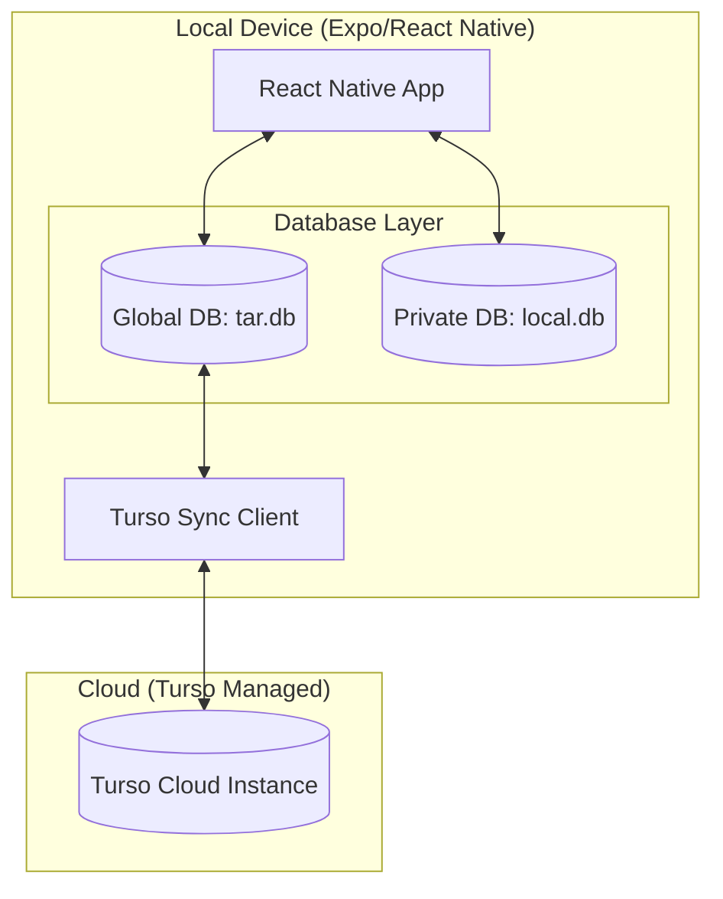

# Turso Local-First Sync Architecture

This document defines the data persistence strategy for Tar Commerce AI. We use a **Local-First** approach powered by Turso's LibSQL SDK for React Native.

---

## 🚀 SDK Quick Start

We use the [`@tursodatabase/sync-react-native`](https://www.npmjs.com/package/@tursodatabase/sync-react-native) package.

### Core Implementation

```typescript
import { Database, getDbPath } from "@tursodatabase/sync-react-native";

// 1. Get platform-specific path (crucial for iOS/Android)
const dbPath = getDbPath("myapp.db");

// 2. Initialize with Sync
const db = new Database({
  path: dbPath,
  url: "libsql://your-db.turso.io",
  authToken: "your-auth-token",
});

// 3. Connect & Transact
await db.connect();
await db.run("INSERT INTO users (name) VALUES (?)", ["Alice"]);
const users = await db.all("SELECT * FROM users");

// 4. Sync Cycle
await db.push(); // Send local changes to cloud
await db.pull(); // Get cloud changes to local
```

---

## 🧠 Dual-Database Architecture

The application maintains two isolated database environments to balance performance, privacy, and connectivity.



### 1. Global Sync Database (`tar.db`)

- **Purpose**: Shared business objects (Actors, Nodes, Streams).
- **Sync**: Bidirectional (Cloud ↔ Device).
- **Access**: `getDb()` and `dbHelpers`.

### 2. Private Local Database (`local.db`)

- **Purpose**: Device-specific metadata (User preferences, local cache, security keys).
- **Sync**: **None**. Data never leaves the device.
- **Access**: `getLocalDb()` and `localDbHelpers`.

---

## 💎 The "Upgrade Path" Strategy

One of the key strengths of this architecture is the ability to move a user from a local-only experience to a cloud-synced experience without data loss.

1.  **Free/Trial Tier**: Initialize the database with **only a local path**.
2.  **Paid/Pro Tier**: Provide the `url` and `authToken` to the **same local file**.
3.  **The Result**: On the first connection after upgrade, the SDK automatically **pushes all existing local data** to the newly assigned cloud instance.

---

## 🛠️ Why LibSQL for Local Data?

Technically, both our databases use the **LibSQL** engine (an open-source, high-performance fork of SQLite). This means you get 100% SQLite compatibility plus extra powers.

| Feature           | LibSQL (Turso)           | Standard SQLite       |
| :---------------- | :----------------------- | :-------------------- |
| **SQL Syntax**    | 100% Compatible          | Standard              |
| **Vector Search** | ✅ Native (F32_BLOB)     | ❌ Needs extension    |
| **Cloud Sync**    | ✅ Native HTTP/SQLD      | ❌ Needs custom logic |
| **Performance**   | Optimized for Moble/Edge | General purpose       |

---

## 📑 Key Benefits of this Setup

- **OS-Native Paths**: Using `getDbPath()` ensures the app follows iOS/Android security policies, preventing data loss during OS updates.
- **Zero Latency**: Every user interaction (read/write) happens against the local disk. You never wait for the spinning wheel of the network.
- **Offline Mode**: The app works flawlessly in airplanes or tunnels. Sync happens automatically when the connection returns.
- **Privacy First**: Personal metadata is stored in `local.db`, separated at the physical file layer from shared business data.

## 📁 Key Files

- [lib/db.ts](file:///c:/tarfwk/tar/lib/db.ts): Core database logic and dual-instance management.
- [.env](file:///c:/tarfwk/tar/.env): Connection strings for the Global Sync instance.
