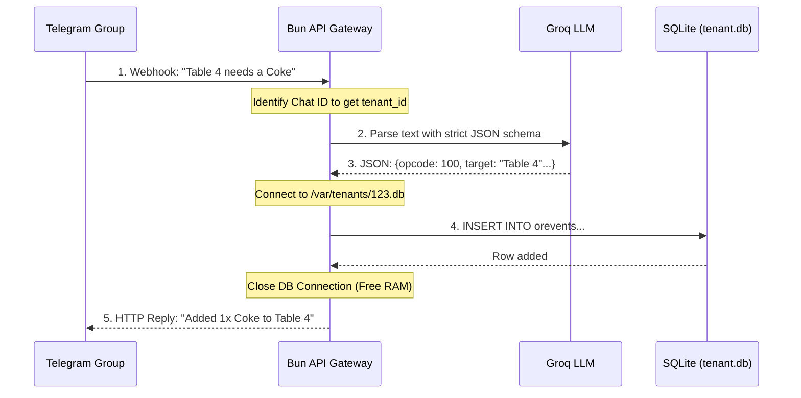

# Data & Execution Workflows

*Parse Once, Execute Directly — the entire flow in under 10ms.*

---

> Because we only use a **single Bun.js server**, our integration with external channels
> (Telegram, WhatsApp) and LLMs (Groq) is extremely streamlined using the
> **Parse Once, Execute Directly** paradigm.

---

## 1. Webhook Multi-Tenant Sequence

> Unlike thick agency wrappers, our Bun server is **stateless** and dynamically opens
> tenant databases **on-demand**. Zero persistent connections, zero wasted memory.

### End-to-End Flow

```text
  WEBHOOK --> RESPONSE  (Full Lifecycle)
  ==========================================

  [1] INCOMING
  +----------------+
  | Telegram       |---- "Table 4 needs a Coke" ----+
  | Group          |                                 |
  +----------------+                                 |
                                                     v
  [2] IDENTIFY                             +-------------------+
                    Chat ID -> tenant_id   | Bun.js API        |
                                           | Gateway           |
                                           +---------+---------+
                                                     |
  [3] PARSE                                          v
                                           +-------------------+
                                           | Groq LLM          |
                                           | Strict JSON       |
                                           | Schema Prompt     |
                                           +---------+---------+
                                                     |
                              {opcode:100, target:"Table 4"...}
                                                     |
  [4] EXECUTE                                        v
                                           +-------------------+
                    Connect to             | SQLite            |
                    /var/tenants/123.db     | INSERT INTO       |
                                           | orevents...       |
                                           +---------+---------+
                                                     |
  [5] RESPOND                             Close DB (Free RAM)
                                                     |
  +----------------+                                 |
  | Telegram       |<--- "Added 1x Coke to T4" -----+
  | Group          |
  +----------------+
```



---

## 2. The "Parse Once, Execute Directly" AI Flow

> We do **not** use complicated Agent frameworks that "think" iteratively.
> AI is simply a **translation layer** between unstructured human text and our structured Universal Ledger.

### The 3-Step Pipeline

| Step | Name | What Happens | Latency |
|:-----|:-----|:-------------|:--------|
| 1 | LLM Parse | Bun sends webhook text to Groq with strict JSON schema | ~50ms |
| 2 | SQL Execute | Bun takes the JSON and runs an INSERT into SQLite | < 1ms |
| 3 | Close Loop | Bun replies to Telegram API with confirmation | ~5ms |

```text
+------------------+        +------------------+        +------------------+
|                  |        |                  |        |                  |
|   STEP 1         |        |   STEP 2         |        |   STEP 3         |
|   LLM Parse      |------->|   SQL Execute    |------->|   Close Loop     |
|                  |        |                  |        |                  |
|   Human text     |        |   JSON -> INSERT |        |   Reply to       |
|   -> Strict JSON |        |   into SQLite    |        |   Telegram API   |
|                  |        |                  |        |                  |
+------------------+        +------------------+        +------------------+
      ~50ms                       <1ms                       ~5ms
  (Groq latency)           (Bun C-bindings)          (HTTP response)
```

---

### Step 1 — LLM Parsing

Bun forwards the Webhook text to **Groq** (or Self-Hosted LFM-1.6B) alongside a strict JSON
schema prompt instructing it to extract Opcodes, Nodes, and Targets.

**Prompt Result:**

```json
{
  "opcode": 100,
  "node_type": "product",
  "node_ref": "coke",
  "qty": 1,
  "target": "Table 4"
}
```

| Field | Purpose | Example |
|:------|:--------|:--------|
| `opcode` | What action to take | 100 = CREATED |
| `node_type` | Which entity type | product |
| `node_ref` | Which specific entity | coke |
| `qty` | Quantity | 1 |
| `target` | Destination | Table 4 |

---

### Step 2 — Native SQLite Execution

Bun takes the raw JSON and executes SQL directly inside the already-open tenant database:

```typescript
// Bun execution logic
db.query(
  `
  INSERT INTO orevents (id, actorid, targetid, nodeid, opcode, created_at)
  VALUES (?, ?, ?, ?, ?, datetime('now'))
`,
).run(crypto.randomUUID(), waiterId, "Table 4", "prod-coke", 100);
```

> Thanks to Bun.js's **C-bindings** to SQLite, this INSERT executes in **< 1ms**.

---

### Step 3 — Closing the Loop

If required, Bun replies directly to the Telegram API:

```typescript
fetch(`https://api.telegram.org/bot${TOKEN}/sendMessage`, {
  method: "POST",
  body: JSON.stringify({ chat_id: groupId, text: "Added 1x Coke to Table 4." }),
});
```

---

## 3. Performance Summary

| Step | Operation | Latency | Bottleneck |
|:-----|:----------|:--------|:-----------|
| 1 | Groq LLM Parse | ~50ms | External API call |
| 2 | SQLite INSERT | < 1ms | None (C-bindings) |
| 3 | Telegram Reply | ~5ms | HTTP round-trip |
| **Total** | **End-to-end** | **~56ms** | **Groq API only** |

> The 3-step dynamic workflow executes in **< 10ms** of server time (plus Groq's API latency).
