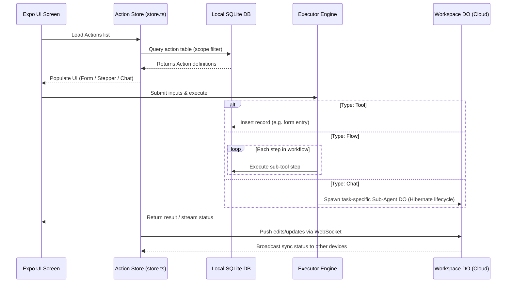

# Actions System Architecture & Refactoring Blueprint

This document defines the goals, system design, data schemas, and execution flows for standardizing and completing the **Actions** architecture in the `tarai` client application.

---

## 1. Objectives & Goals

The core objective is to transition from the legacy "Skill" architecture to a decoupled, schema-driven **Action** model that integrates with the Model Context Protocol (MCP) and local-first SQLite/Durable Object sync.

Key goals:
1. **Decoupled Architecture:** Separate how an action is presented (UI), how inputs are collected, and how it is executed.
2. **MCP Integration:** Map actions dynamically to MCP Tools, allowing any LLM client to discover and call them.
3. **Local-First State:** Persist both built-in and user-created actions in local SQLite with background sync.
4. **Rich UI Renderers:** Dynamically render interfaces based on action type (Forms, Workflows, or Chat sessions).

---

## 2. Decoupled System Architecture

Actions decouple the presentation layer from the execution handler. Triggering an action runs through a three-tier pipeline:

```mermaid
graph TD
    subgraph Tier 1: UI Presentation
        UI_Static[Static UI: Pre-built Form]
        UI_Dynamic[Dynamic UI: Conditional Layout]
        UI_Gen[Generated UI: Schema-Driven Screen]
    end

    subgraph Tier 2: Input Interaction
        In_Expo[Expo Form Elements]
        In_Chat[Conversational Chat Box]
        In_Voice[Voice-to-Text Input]
    end

    subgraph Tier 3: Execution Tier (MCP)
        Exec_Tool[Tool: Direct Function/SQLite Write]
        Exec_Flow[Workflow: Chained Tool Sequences]
        Exec_Agent[Agent: LLM Orchestration & Sub-Agents]
    end

    Tier 1 -->|Renders| Tier 2
    Tier 2 -->|Submits Inputs to| Tier 3
```

### The Three-Tier Architecture Mapping

| Tier | Component | Description | MCP/System Mapping |
| :--- | :--- | :--- | :--- |
| **1. UI Presentation** | **Static UI** | Pre-built screens with fixed components. | Renders standard layout. |
| | **Dynamic UI** | Interface adapts layout based on input state. | Renders conditional fields. |
| | **Generated UI** | Schema auto-rendered on-the-fly. | Built from `ActionDef.fields` JSON schema. |
| **2. Input Interaction** | **Structured** | Form fields, select boxes, dates (Expo UI). | Traditional form validation. |
| | **Conversational**| Chat inputs processed via natural language. | Parameters parsed by LLM. |
| | **Voice** | Transcribed voice inputs. | Audio to text $\rightarrow$ LLM parsing. |
| **3. Execution Tier** | **Tool** | Atomic database write or API call. | Maps directly to **MCP Tool** (`tools/call`). |
| | **Workflow (Flow)**| Sequential execution of multiple tools. | Sequential pipeline of **MCP Tool Calls**. |
| | **Agent** | Autonomous loop using planning & memory. | Runs as **MCP Client** orchestrating tools. |

---

## 3. Data Schemas & Definitions

All actions are defined by the `ActionDef` interface and stored in SQLite:

### Action Definition Schema (`src/actions/definitions.ts`)

```typescript
export type ActionType = 'tool' | 'flow' | 'chat';

export interface ActionField {
  name: string;
  type: 'text' | 'number' | 'select' | 'textarea' | 'date' | 'phone' | 'email' | 'rating';
  label: string;
  required?: boolean;
  placeholder?: string;
  options?: string[];
}

export interface ActionDef {
  id: string;
  name: string;
  description: string;
  vertical: string; // e.g., 'crm', 'pay', 'task'
  icon: string;
  keywords?: string[];
  type: ActionType; // 'tool' | 'flow' | 'chat'
  fields: ActionField[];
  execute?: (values: Record<string, any>) => {
    formType: string;
    formScope: string;
    title: string;
    data: Record<string, any>;
  };
  creates?: CreatesMapping;
  custom?: boolean;
  builtIn?: boolean;
}
```

### SQLite Database Table (`action`)

Custom actions are stored locally in SQLite and synchronized to the Workspace DO:

```sql
CREATE TABLE IF NOT EXISTS action (
  id TEXT PRIMARY KEY,
  creator_id TEXT,
  parent_id TEXT, -- References parent action if copy-on-write customized
  scope TEXT DEFAULT 'team', -- 'team' (synced) or 'personal' (local-only)
  type TEXT DEFAULT 'tool', -- 'tool' | 'flow' | 'chat'
  name TEXT NOT NULL,
  description TEXT DEFAULT '',
  vertical TEXT DEFAULT 'general',
  icon TEXT DEFAULT 'document-outline',
  keywords TEXT DEFAULT '[]', -- JSON string array
  fields TEXT DEFAULT '[]', -- JSON ActionField array
  data TEXT DEFAULT '{}', -- Custom execution configs (steps or prompts)
  created_at TEXT DEFAULT CURRENT_TIMESTAMP,
  updated_at TEXT DEFAULT CURRENT_TIMESTAMP
);
```

---

## 4. Execution & Synchronization Flow

The execution workflow is driven local-first, with WebSocket-based Durable Object synchronization.



---

## 5. AI Action Generation & Customization

Users can customize built-in actions or create brand new ones using natural language:

1. **AI Generation:** The user describes their need (e.g., *"Create an attendance tracker"*). The client requests the LLM to generate an `ActionDef` schema using `ACTION_SYSTEM_PROMPT`.
2. **Saving Custom Action:** The generated `ActionDef` JSON is inserted into SQLite with `custom: true`, immediately registering it with the local MCP server.
3. **Copy-on-Write Customization:** If a user edits a built-in seed action, it duplicates the record in SQLite as a custom action, referencing the original via `parent_id`.

---

## 6. Implementation Checklist & Status

> [!NOTE]
> Progress tracking for the full migration of the Actions system.

- [x] **Step 1: Directory & File Renames**
  - Rename `src/skills` to `src/actions`
  - Rename components (`SkillExecutor` $\rightarrow$ `ActionExecutor`, `SkillForm` $\rightarrow$ `ActionForm`)
  - Rename screen `skills.tsx` $\rightarrow$ `actions-catalog.tsx` (avoids feed conflict)
- [x] **Step 2: Type Definition Refactoring**
  - Rename interface definitions to `ActionDef`, `ActionField`
  - Add `ActionType` (`tool` \| `flow` \| `chat`)
- [x] **Step 3: Database Schema Migration**
  - Update `src/lib/db.ts` table setup (rename `skill` table to `action`)
  - Add `type`, `creator_id`, `parent_id`, `scope` columns
- [x] **Step 4: Update Action Seeder (`src/actions/seed.ts`)**
  - Convert seeded built-in definitions to use new `ActionDef` structure and assign `type: 'tool'`
- [x] **Step 5: Refactor Executor Engine (`src/actions/executor-engine.ts`, `executor.ts`)**
  - Update imports and rename executor types/functions
  - Wire up execution handlers to support Tool, Flow, and Agent routing
- [x] **Step 6: Update Action Store (`src/actions/store.ts`)**
  - Rename variables, queries, and vector indexes to query the `action` table
- [x] **Step 7: UI & Navigation Integration**
  - Update imports in all view screens (`actions.tsx`, `browse.tsx`, `settings.tsx`, `_layout.tsx`)
  - Update navigation tabs/labels from "Skills" to "Actions"
