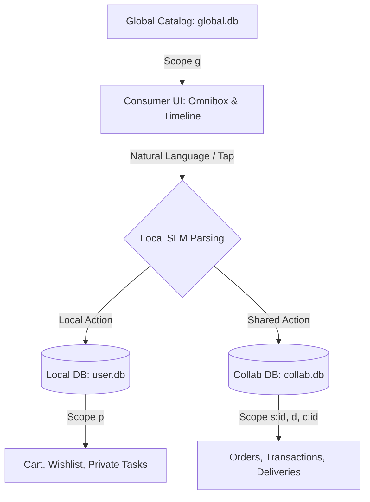

# Consumer Workflows & Agentic Use Cases in TAR

This document outlines the concrete use cases and workflows showing how consumers utilize the TAR local-first, sync-optimized architecture. It combines the database schema layers defined in [plan.md](file:///c:/tarfwk/tar/docs/plan.md) with the AI-driven interfaces from [aigui.md](file:///c:/tarfwk/tar/docs/aigui.md) to explain how operations like checking order status, managing shopping carts, tracking deliveries, and lodging support tickets function on-device and in sync with the cloud.

---

## 1. Core Architectural Mapping for Consumers

When a consumer interacts with the application, their actions are translated by the Local SLM (Small Language Model) into database changes across the five core tables:



---

## 2. Comprehensive Consumer Use Cases

### Use Case A: Finding & Tracking Order Status ("Where is my order?")
This is the core consumer query. Instead of navigating multiple dashboards, the user queries the system using natural language or looks at their unified feed.

#### 1. The Interaction Flow
* **Natural Language Query (AI Omnibox):** The consumer types or speaks: *"Where is my coffee maker order?"*
* **Traditional UI Navigation (Universal Timeline):** The consumer scrolls to the **Future/Active Timeline** on the home screen where active orders are pinned as cards.

#### 2. Under the Hood (Database Mechanics)
1. **Semantic Search via Embeddings:**
   * The local app queries the `memory` table to match the term `"coffee maker"` with recent order records in the local cache. It matches `"coffee maker"` to `matter` ID `prod_coffeemaker_42` and its active order `motion` stream.
2. **Kinetic Ledger Inspection:**
   * The system checks the `motion` table for rows matching the order's stream:
     ```sql
     SELECT action, status, time 
     FROM motion 
     WHERE stream = 'mot_order_999' 
     ORDER BY seq DESC 
     LIMIT 1;
     ```
3. **State Resolution:**
   * The current status of the order is determined by the latest `motion` row's `status` and `action` (opcode):
     * If latest is `105 (ORDER_PLACED)` $\rightarrow$ Status: **Placed (Awaiting Store Confirmation)**
     * If latest is `106 (CONFIRMED)` $\rightarrow$ Status: **Confirmed by Merchant**
     * If latest is `107 (PREPARING)` $\rightarrow$ Status: **Preparing / In Kitchen**
     * If latest is `108 (READY)` $\rightarrow$ Status: **Ready for Pickup**
     * If latest is `134 (DISPATCHED)` / `135 (IN_TRANSIT)` $\rightarrow$ Status: **Out for Delivery**
     * If latest is `109 (DELIVERED)` $\rightarrow$ Status: **Delivered successfully**

#### 3. Visual Representation (Concept B: Universal Timeline)
```text
+--------------------------------------------------------------+
| 📦 ORDER STATUS: Coffee Maker (#999)                         |
|    Status: IN TRANSIT (Opcode 135) | Updated: 5 mins ago     |
|                                                              |
|   [Placed] -----> [Confirmed] -----> [Preparing] -+          |
|                                                   |          |
|   [Delivered] <--- [In Transit (Active)] <--------+          |
|                                                              |
|   📍 Live Location: T-Nagar (Geo: 88c0a8dd55fffff)           |
+--------------------------------------------------------------+
```

---

### Use Case B: Shopping Cart & Wishlist Management (Offline-First)
Consumers browse catalogs and build orders completely offline without generating network requests or cloud database cost.

#### 1. The Interaction Flow
* **Action:** Consumer clicks "Add to Cart" or types in the Omnibox: *"Add two thermos flasks and one bottle to my cart."*

#### 2. Under the Hood (Database Mechanics)
1. **Reading Catalogs:** The UI reads from the public catalog in `global.db` (Scope `g`):
   ```sql
   SELECT * FROM matter WHERE code = 'THERMOS_99' AND scope = 'g';
   ```
2. **Local Write (No-Cost):** The app writes the state to the private `user.db` using opcodes `102` (`CART_ADD`) or `114` (`WISHLISTED`):
   ```sql
   INSERT INTO motion (id, stream, seq, action, status, scope, data)
   VALUES ('mot_cart_123', 'prod_thermos_99', 1, 102, 'IN_CART', 'p', '{"qty": 2}');
   ```
   * **Why this is free:** Because the scope is `p` (Personal), this operation writes directly to local SQLite (`user_${google_user_id}.db`). It does not sync to Turso, saving 100% of network/database writes.

---

### Use Case C: Checkout and Payments
Converting a local cart into a shared, confirmed transaction ledger.

#### 1. The Interaction Flow
* **Action:** Consumer clicks "Checkout & Pay".

#### 2. Under the Hood (Database Mechanics)
1. **Transitioning Local Cart:** The app gathers all `CART_ADD` rows from `user.db` and triggers a status update `CHECKOUT` (Opcode 104) in `collab.db`.
2. **Order Registration:** An immutable transaction log is appended to `collab.db` (storefront scope `s:102`) representing the placed order:
   * **`motion` record:** `id = mot_order_999`, `action = 105 (ORDER_PLACED)`, `status = 'PENDING'`, `scope = 's:102'`, `delta = 1798.00` (price).
3. **Identity Relationship Linking:**
   * A link is established in the `relation` table to connect the user's authenticated profile to the order:
     * `src = usr_googleid` (Source consumer profile)
     * `tgt = mot_order_999` (Target order stream)
     * `type = 'placed_order'`
4. **Payment Ledger Entry:**
   * When the payment gateway completes, an append-only `motion` row is written for `PAYMENT_SUCCESS` (Opcode 802):
     ```sql
     INSERT INTO motion (id, stream, seq, action, status, scope, delta)
     VALUES ('mot_pay_888', 'mot_order_999', 2, 802, 'PAID', 's:102', 1798.00);
     ```

---

### Use Case D: Real-Time Delivery Tracking
Tracking the transit status and GPS location of physical goods.

#### 1. The Interaction Flow
* **Action:** The consumer opens the order details card to see the delivery driver's progress.

#### 2. Under the Hood (Database Mechanics)
1. **Driver Assignment:** When a driver is matched, the backend writes a status update `DRIVER_ASSIGNED` (Opcode 136) and links the driver profile `usr_driver_77` to the order via `relation` (`type = 'delivering_agent'`).
2. **Active Transit updates:** As the driver moves, the driver's device writes location coordinates directly to the delivery `mass` row:
   ```sql
   UPDATE mass 
   SET geo = '88c0a8dd55fffff', -- H3 index coordinate
       value = 1685463600 -- Updated ETA timestamp (Opcode 137 / ETA_UPDATED)
   WHERE id = 'mas_delivery_999';
   ```
3. **Consumer UI Update:** The consumer's local sync client pulls updates for scope `d` (Logistics). The map component reads `mass.geo` and updates the vehicle icon's coordinates on screen.

---

### Use Case E: Returns, Refunds, & Support Tickets
Handling post-delivery issues through relational links and kinetic ticket chat streams.

#### 1. The Interaction Flow
* **Action:** Consumer selects a delivered item and clicks "Return/Refund" or types *"Request a return for my broken thermos."*

#### 2. Under the Hood (Database Mechanics)
1. **Ticket Initiation:**
   * Appends a `motion` ticket log to the CRM scope (`c:customer_id`):
     * `action = 306 (TICKET_OPEN)`
     * `status = 'OPEN'`
     * `data = {"reason": "damaged item"}`
2. **Relational Linking (Interactive Graph):**
   * The system links the support ticket to the original order stream:
     * `src = mot_ticket_777`
     * `tgt = mot_order_999`
     * `type = 'disputes_order'`
3. **Conversational Updates:**
   * Support agent response and customer replies are recorded as sequential `307 (REPLY)` actions appended to the `mot_ticket_777` stream.
4. **Resolution:**
   * If approved, the merchant triggers `REFUND` (Opcode 111) and updates the ticket status to `RESOLVED` (Opcode 308).

---

## 3. Step-by-Step Scenario Summary

The table below traces a single consumer order lifetime from browsing to delivery, mapping the User Action, the UI Presentation, and the Database Execution:

| Step | User Action | UI Concept / Component | Triggered DB Execution (Opcodes & Tables) | Target Database |
| :--- | :--- | :--- | :--- | :--- |
| **1** | Searches for "thermos" | AI Omnibox / Catalog Search | Reads `matter` & `memory` (embeddings) | `global.db` / local cache |
| **2** | Taps "Add to Cart" | Product Card button / green feedback | `INSERT` action `102` (`CART_ADD`) in `motion` | `user.db` (Local Only) |
| **3** | Clicks Checkout | Smart Form summary & Pay button | `UPDATE` action `104` (`CHECKOUT`) in `motion` | `collab.db` (Store Scope) |
| **4** | Completes payment | Spinner turns to Success Receipt | `INSERT` action `105` (`ORDER_PLACED`) & `802` (`PAYMENT_SUCCESS`) | `collab.db` (Store Scope) |
| **5** | Checks status | Universal Timeline (Concept B) | `SELECT` latest `motion` from order stream | Local Cache / Sync |
| **6** | Tracks driver route | Map view with driver coordinates | Reads `mass.geo` and `mass.value` (ETA) | Local Cache (Logistics Scope) |
| **7** | Receives package | Notification / Timeline completed | `UPDATE` action `109` (`DELIVERED`) in `motion` | `collab.db` (Store Scope) |

---

## 4. UI Indicators for Sync States

Because consumers might be offline or have intermittent connectivity, the UI uses specialized visual cues to show synchronization status:

* **Outbox Pending (Dotted Border / ⏳):**
  * Applied to timeline rows or cards where the SQLite record is written locally in `collab.db` but has not yet synced to the central Turso server via the Cloudflare Workers gateway.
* **Synced (Solid Border / Checkmark):**
  * Applied once the background Turso sync confirms matching `seq` and `id` keys are stored globally.
* **Scope Badging:**
  * **Personal (`p`):** Visual lock icon 🔒.
  * **Storefront / Collab (`s:id`):** Store branch name badge.
  * **Logistics (`d`):** Delivery vehicle status badge.
