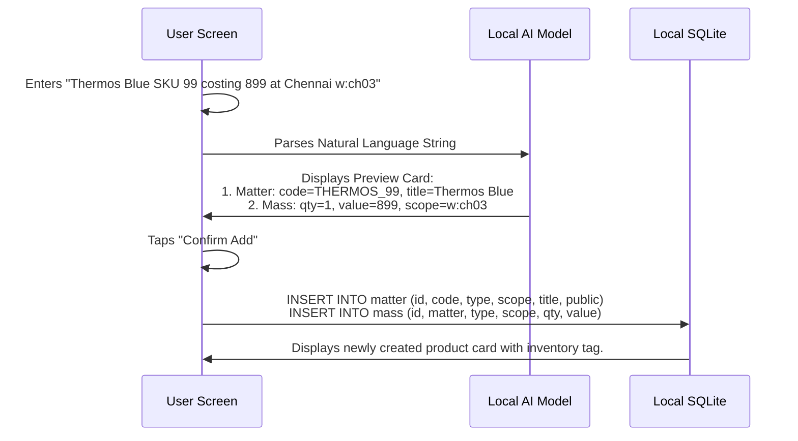

# GUI Architecture Design: Unified Local-First AI Interface (TAR)

This document outlines the design concepts, screen flows, and technical UI mapping for performing **CRUD operations** on the TAR universal data layers (**Matter, Mass, Motion, Relation**) using on-device local AI models, embedding models, and offline-first workflows.

---

## 1. Core GUI Philosophy: "Physics made Simple"

The database tables represent highly abstract physical concepts. To make them user-friendly, the GUI translates them into familiar, intuitive metaphors:

| DB Table | Physical Concept | User Interface Metaphor | UI Representation |
| :--- | :--- | :--- | :--- |
| **`matter`** | Intrinsic Identity | **Templates / Catalogs** | "The Library" (Products, Forms, Tasks, User Profiles) |
| **`mass`** | Physical Realization | **Inventory, Slots & Roster** | "The Calendar & Map" (Stock levels, Shifts, Geo-pins, Deadlines) |
| **`motion`**| Kinetic Ledger | **Unified Activity Feed** | "The Stream" (Chat timeline, Audits, Transactions, Reminders) |
| **`relation`**| Structural Network| **Connectors & Hierarchy** | "The Links" (Sub-tasks, Bundled items, Customer-to-Campaign) |

By leveraging **local AI (SLMs like Phi-3 or Llama-3)** and **local Embedding Models (384-dim MiniLM)**, the interface eliminates manual database fields, complex schemas, and nested navigation.

---

## 2. Local AI & Embedding Model Integration

### A. Semantic Search & Fuzzy Reference Mapping
* **How it works:** When a user creates a new record that references another (e.g. creating `mass` for a `matter`), they shouldn't scroll through list-boxes.
* **UI Detail:** An input box powered by the local embedding table (`memory` table).
* **Example:** Typing *"Add stock for the blue hot water bottle"* vector-searches the local embedding index, matching `"blue hot water bottle"` to `matter` ID `prod_thermos_99` (Title: *"Water Heater Pressure Leak"* / *"Thermos Blue SKU 99"*).

### B. Natural Language Intent Parsing (The AI Omnibox)
* **How it works:** A single text field or voice-mic button accepts natural language commands and extracts structured data.
* **UI Detail:** The local model parses the text and displays a live "Proposed State Card" showing what tables will be modified before writing to SQLite.
* **Example:** *"Ramesh shift starts now in T-Nagar"*
  * **Parsed intent:**
    * `motion` stream: `usr_ramesh`
    * `action`: `202 (SHIFT_START)`
    * `scope`: `h:staff` (mapped to HR Staff scope)
    * `data`: `{"location": "T-Nagar"}`

### C. Generative Schema Field Generator (`data` JSON)
* **How it works:** The `data` column in `matter`, `mass`, and `motion` stores arbitrary JSON. Writing JSON manually in a mobile app is impossible.
* **UI Detail:** When creating a template, the user inputs a title (e.g., *"Plumbing Service"*). The local AI generates custom input fields dynamically (e.g., `water_pressure`, `pipe_size`, `emergency_leak_toggle`).

---

## 3. Four UX Concepts for CRUD Operations

### Concept A: The AI Omnibox (Omnipresent Natural Language Bar)
The ultimate simple, single-field CRUD experience. Ideal for quick ledger writing and field operations.

```text
+-------------------------------------------------------------+
|  [🎤] Type or speak: "clock in warehouse ch03"               |
+-------------------------------------------------------------+
                            |
                            V (Local SLM Processing)
+-------------------------------------------------------------+
| Proposed Action: CLOCK_IN                                   |
| - Target Table: motion (Append)                             |
| - Stream: usr_googleid                                      |
| - Scope: w:ch03 (Warehouse CH03)                            |
| - Opcode: 501                                               |
|                                     [Cancel]  [Confirm]     |
+-------------------------------------------------------------+
```

* **Create:** Enter plain text like *"New product Blue Thermos 99 costing 899"* $\rightarrow$ Creates `matter` and initial `mass` entry.
* **Read:** Search *"show all pending tasks"* $\rightarrow$ Semantic query returns active future timeline events.
* **Update:** *"Thermos 99 price is now 999"* $\rightarrow$ Updates `value` in `mass` where `matter` is linked to code `THERMOS_99`.
* **Delete:** *"Remove active shift for warehouse"* $\rightarrow$ Sets `active = 0` on matching `mass` or updates `motion` status.

---

### Concept B: The Universal Timeline (Timeline-based Motion CRUD)
Every kinetic event (past logs or upcoming reminders) appears in a single scrolling feed.

```text
[ FUTURE TIMELINE - PENDING ACTIONS ]
+-------------------------------------------------------------+
| 🔔 [Reminder] Pay Electricity Bill                          |
|    Target: Bill Matter | Status: PENDING | Time: 5:00 PM     |
|    [Mark Completed]                                         |
+-------------------------------------------------------------+

----------------------- [ NOW ] -------------------------------

[ PAST TIMELINE - KINETIC LEDGER ]
+-------------------------------------------------------------+
| 💸 [POS Sale] Sold 1x Thermos 99 (Opcode 101)               |
|    Stream: prod_thermos_99 | Time: 10 mins ago              |
+-------------------------------------------------------------+
| 🏁 [Shift Start] Checked into w:ch03 (Opcode 202)            |
|    Stream: usr_ramesh | Time: 2 hours ago                    |
+-------------------------------------------------------------+
```

* **Create / Schedule:** Pull down from the top to reveal a date/time picker, or swipe a past item to reschedule (creates a new future `motion` with status `PENDING`).
* **Read:** Infinite scroll. Up is the future, down is the past.
* **Update / Action:** Tap on a pending task item to toggle its state (e.g. tapping "Mark Completed" triggers a status update to `COMPLETED` (Opcode 702)).
* **Delete:** Swipe left to cancel/remove the reminder/event (updates status to `CANCELLED` (Opcode 703) or local-only purge).

---

### Concept C: The Interactive Graph-Card View (Visual Node Connectors)
Best for representing structure and relations (e.g., Parent tasks, Blocked lists, Product Bundles, Customer leads).

```text
   +------------------+                    +------------------+
   |  Matter Card     |                    |  Matter Card     |
   |  (Parent Task)   |                    |  (Blocked Task)  |
   |  "Clean Kitchen" |                    |  "Buy Detergent" |
   +--------+---------+                    +--------+---------+
            |                                       |
            | (Drag & drop connector line)          |
            v                                       v
   +----------------------------------------------------------+
   |                       RELATION                           |
   |  Source: Clean Kitchen | Target: Buy Detergent           |
   |  Relationship Type: "blocked_by"                         |
   +----------------------------------------------------------+
```

* **Create:** Drag one card onto another. A popup menu asks for the relationship type: `parent-child`, `blocked_by`, or custom.
* **Read:** Displayed as nested checklists, collapsible cards, or a radial graph network.
* **Update:** Double-tap a relation line to modify the `weight` slider (e.g. prioritizing a path).
* **Delete:** Tap the cross icon "X" on the connection line to unlink the two nodes.

---

### Concept D: The Context-Aware Smart Form (Modular CRUD panels)
Traditional forms upgraded with contextual dropdowns, scope maps, and AI-predicted schemas.

```text
+-------------------------------------------------------------+
| CREATE MATTER                                               |
|                                                             |
| Title: [ Water Heater Leak Task                          ]  |
| Type:  [ task         ] (AI suggestion: Task Template)       |
| Scope: [ p            ] (AI: Set to Personal Workspace)     |
|                                                             |
| --- Custom Fields (AI Generated) -------------------------- |
| [x] Emergency Severity Level (High/Med/Low)                 |
| [ ] Required Spare Parts List                               |
|                                                             |
|                                                   [Save]    |
+-------------------------------------------------------------+
```

* **Scope Selectors:** Dynamic badges (`p`, `g`, `s:102`, `w:ch03`) automatically flag where the data goes:
  * Local private: `user.db`
  * Shared cloud: `collab.db`
  * Public catalogs: `global.db`
* **JSON schema inputs:** Uses a toggle checklist instead of manual JSON text syntax.

---

## 4. Database Write Strategy Integration

The UI handles database writing behind the scenes to save costs and optimize Turso bandwidth (Chennai scale operations):

1. **Local Operations (`user.db`):**
   * Actions like `CART_ADD` (102), `WISHLISTED` (114), or private task rosters (`p` scope) write directly to the local SQLite file.
   * **GUI feedback:** Quick green checkmark without loading spinners.

2. **Status Updates (`collab.db`):**
   * Toggling checkout states, preparing orders, or updating driver locations will mutate rows *in-place* to limit bandwidth.
   * **GUI representation:** Dynamic state buttons (e.g., `[Preparing]` $\rightarrow$ `[Ready]` $\rightarrow$ `[Delivered]`).

3. **Ledger Appends (`collab.db`):**
   * Final payments, sales, and clock-ins insert unique immutable events.
   * **GUI representation:** Receipt view, non-editable transaction badges, history timelines.

---

## 5. Screen Flow Walkthroughs

### Scenario 1: Creating a New Product Catalog Item and Stock Level



### Scenario 2: Connecting a Customer Profile with an Invoice (Relation + Motion)

1. Open the **Customer Card** (Matter).
2. Tap the `[+] Link` button. The app uses the **Embedding Model** to recommend targets based on recent activities.
3. Select the target **Invoice Card** (Matter).
4. Select Relation: `"billed_to"`.
5. Tap `[Pay]` $\rightarrow$ Appends `motion` log with opcode `802 (PAYMENT_SUCCESS)`, updating the visual status indicators across both cards to green.

---

## 6. Offline-First User Experience Safeguards

* **Visual Queue Status:** Since syncing is offline-first, records that haven't reached Turso yet show a **dotted border** or an **"Outbox" icon (⏳)**.
* **Scope Isolation Visuals:**
  * Personal items (`p`) show a padlock indicator.
  * Shared team/family items (`t:id`, `f:id`) show profile circle avatars of collaborators.
  * Public items (`g`) show a globe indicator.

---

## 7. React Native & Vercel AI SDK Integration

In a React Native (Expo) environment, the **Vercel AI SDK** (`ai` package) serves as the developer-facing orchestrator for connecting the mobile UI to on-device and remote LLMs. 

### A. Core Benefits for the TAR Mobile App
1. **Guaranteed Schema Conformance (`generateObject` / `streamObject`):**
   * Instead of writing custom parsing rules or regex to match LLM outputs to local SQLite tables, we use Zod schemas. The SDK guarantees that the output structure conforms exactly to the database schema.
2. **Provider Agnostic (Hybrid Local/Cloud Execution):**
   * **Local ExecuTorch Mode:** For offline execution, we wrap the native `LLMModule` from `react-native-executorch` (which executes the downloaded LFM models) inside a custom Vercel AI SDK provider.
   * **Cloud Sync Mode:** Seamlessly switch to remote LLM endpoints (like Cloudflare Workers AI or Groq/OpenAI APIs) for complex logic when connectivity is available.
3. **Optimized UI Streaming (`useChat` & `useCompletion` hooks):**
   * Reduces user perceived latency in React Native by streaming tokens directly into the **Universal Timeline** (Concept B) or conversational inputs.

### B. Implementation Blueprint: Custom ExecuTorch Provider for Vercel AI SDK

Below is a complete blueprint showing how to wrap `LLMModule` from `react-native-executorch` into the Vercel AI SDK's custom `LanguageModelV1` interface, and how to use it with `generateObject` to parse natural language commands directly on the device:

```typescript
import { generateObject, LanguageModelV1 } from 'ai';
import { LLMModule, Message } from 'react-native-executorch';
import { z } from 'zod';

// 1. Create the Custom Vercel AI SDK Provider wrapping ExecuTorch's LLMModule
export function createExecutorchProvider(llmInstance: LLMModule): LanguageModelV1 {
  return {
    specificationVersion: 'v1',
    provider: 'react-native-executorch',
    modelId: 'lfm-2.5-on-device',
    defaultObjectGenerationMode: 'json',

    async doGenerate(options) {
      // Map prompt/messages formatting to react-native-executorch format
      let formattedPrompt = '';
      if (options.inputFormat === 'prompt') {
        formattedPrompt = options.prompt;
      } else {
        // Map messages array to raw instruction prompt format
        formattedPrompt = options.prompt
          .map((msg: any) => `${msg.role === 'user' ? 'User' : 'Assistant'}: ${msg.content}`)
          .join('\n') + '\nAssistant:';
      }

      // Run local inference on-device
      const outputText = await llmInstance.forward(formattedPrompt);

      return {
        text: outputText,
        finishReason: 'stop',
        usage: {
          promptTokens: llmInstance.getPromptTokensCount() || 0,
          completionTokens: llmInstance.getGeneratedTokenCount() || 0,
        },
      };
    },
  };
}

// 2. Define the target schemas matching the TAR database structure
const TARSchemaParser = z.object({
  targetTable: z.enum(['matter', 'mass', 'motion', 'relation']),
  action: z.enum(['INSERT', 'UPDATE', 'APPEND', 'DELETE']),
  opcode: z.number().describe('The action event opcode from plan.md (e.g., 501 for CLOCK_IN, 101 for SOLD)').optional(),
  payload: z.object({
    id: z.string().describe('Unique primary key ID (e.g., prod_thermos_99, mot_deliv_101)'),
    code: z.string().describe('Human readable unique SKU/code if table is matter').optional(),
    scope: z.string().describe('Scope code (e.g., p, g, w:ch03, s:102)'),
    title: z.string().describe('Display title for matter templates').optional(),
    qty: z.number().describe('Physical count/quantity if table is mass').optional(),
    value: z.number().describe('Value, price, or cost mapping if table is mass').optional(),
    data: z.record(z.any()).describe('JSON metadata payload containing custom dynamic fields').optional(),
  })
});

// 3. React Native helper to parse commands using local ExecuTorch instance
export async function handleLocalOmniInput(llmInstance: LLMModule, inputText: string) {
  const localModel = createExecutorchProvider(llmInstance);

  const { object } = await generateObject({
    model: localModel,
    schema: TARSchemaParser,
    prompt: `Translate this user request to the target database payload. Output JSON conforming to schema: "${inputText}"`,
  });

  return object; // Type-safe parsed database action
}
```
