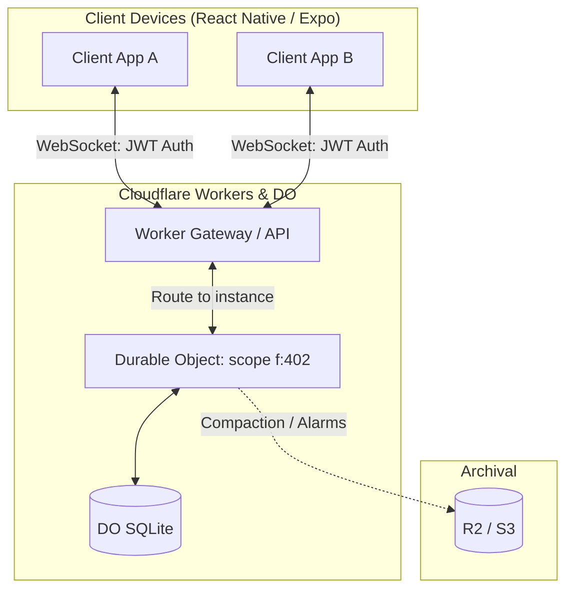
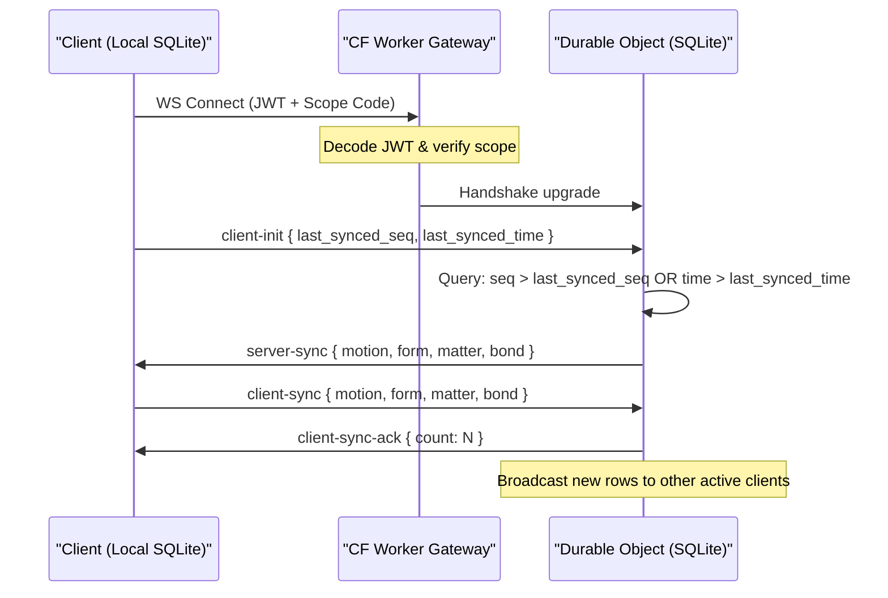
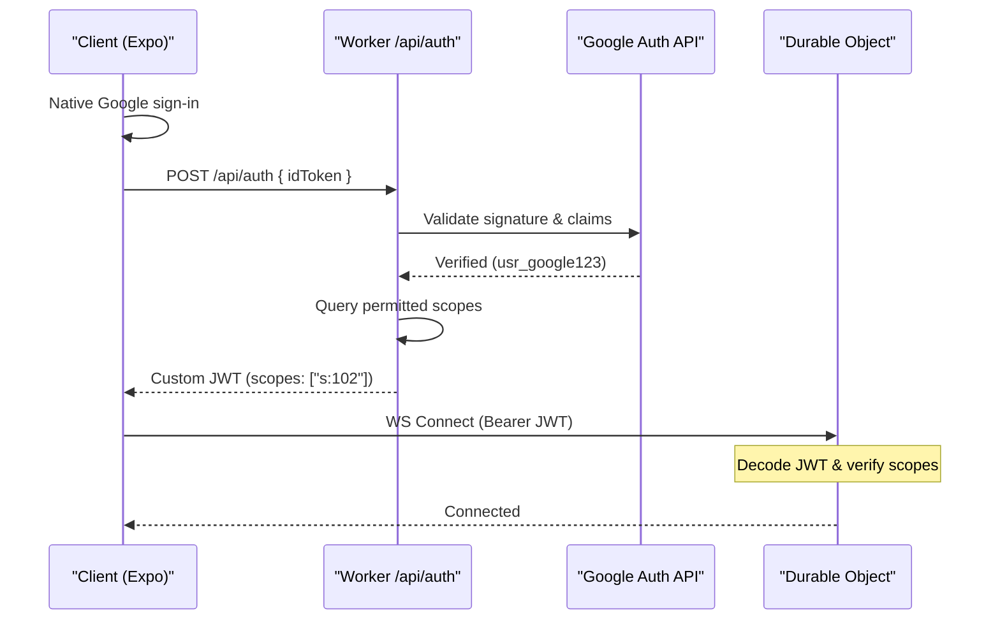

# 02 — Sync Protocol

Custom edge sync using **Cloudflare Workers + Durable Object SQLite**. Replaces Turso Cloud replication and avoids third-party sync engines (LiveStore etc.), tailoring the protocol to TAR's ledger design.

> Table names below use the new model (`form`/`matter`/`motion`/`bond`). The code in `tarapp` still uses legacy names — see [README](README.md#naming-note-legacy--new).

---

## 1. Overview

Local-first, database-per-scope. Collaborative data syncs at the edge via Durable Objects.



**Why this model:**
- **Zero egress fees** — Cloudflare doesn't bill network egress (the old Turso cost driver: ~$2,400/mo for 9.6 TB).
- **Ledger-optimized** — sync only transfers missing monotonic `motion` events; no heavy CRDT engine.
- **No lock-in** — only standard WebSockets + SQLite; avoids Expo build-stability risk.
- **Scope routing** — namespaces (`f:{id}`, `s:{id}`) map directly to DO instances, spun up/down on demand.

---

## 2. Sync protocol

Replication covers all 4 stateful tables. Because `form`, `matter`, `bond` are mutated directly (not always via a ledger entry), they sync alongside `motion` using **two watermarks**:

1. **`last_synced_seq`** — highest `seq` synced from `motion`.
2. **`last_synced_time`** — last synced `time` for `form`, `matter`, `bond`.

### Handshake



### Offline → online reconciliation

| Phase | Trigger | Client | Durable Object | Merge strategy |
| :--- | :--- | :--- | :--- | :--- |
| 1. Offline | user edits offline | append to local `motion`; write `form`/`matter`/`bond` | inactive | local cache; monotonic keys prevent collisions |
| 2. Reconnect | network restored | send `client-init` with both watermarks | Worker validates JWT, wakes DO | aligns logical + physical clocks |
| 3. Catch-up | pull remote | apply `server-sync` rows | query `seq >` OR `time >` | server-first integration |
| 4. Upload | push local | send `client-sync` | insert rows, ack, broadcast | sub-50ms fan-out |
| 5. Resolve | consolidate | fold `motion` for views | daily compaction → R2/S3 | no merge conflicts (monotonic / LWW) |

### Per-table conflict resolution

| Table | Risk | Strategy | Result |
| :--- | :--- | :--- | :--- |
| `motion` | concurrent phase updates | CRDT merge of `ph` map in `data` | union of all transitions |
| `matter` | concurrent qty/state edits | ledger folding of `motion.delta` | balances recalculated |
| `bond` | concurrent link/unlink | PK constraint + LWW on `time` | correct graph state |
| `form` | concurrent metadata edits | LWW on `time` | most recent wins |

---

## 3. WebSocket message classes

| Class | Persistence | Examples | Schema impact |
| :--- | :--- | :--- | :--- |
| Sync ops | Persistent (SQLite) | order lifecycles, `SOLD`, `ETA_UPDATED`, `CLOCK_IN`, `FORM_SUBMIT`, bond changes | writes `motion`/`form`/`matter`/`bond` |
| Transient real-time | Ephemeral (memory) | presence, typing, live GPS, cart locks | broadcast only, bypasses SQLite |
| Control | Non-persistent | `client-init`, `client-sync-ack`, `ping`/`pong` | watermarks, hibernation |

### Message formats

**`client-init`**
```json
{ "type": "client-init", "scope": "s:102",
  "last_synced_seq": 1718300000000,
  "last_synced_time": "2026-06-13T12:00:00.000Z" }
```

**`server-sync`** (DO → client, catch-up)
```json
{ "type": "server-sync",
  "motion": [ { "stream":"matter_stock_99","seq":1718300010001,"action":101,"phase":1,"delta":-1.0,"data":"{\"variant\":0}" } ],
  "form":   [ { "id":"form_thermos_99","code":"SKU-THERM-99","type":"product","scope":"s:102","title":"Smart Thermos 500ml","public":0,"data":"{\"base_price\":19.99}","time":"2026-06-13T12:05:00.000Z" } ],
  "matter": [], "bond": [] }
```

**`client-sync`** (client → DO, upload)
```json
{ "type": "client-sync",
  "motion": [ { "stream":"matter_stock_99","seq":1718300015002,"action":102,"phase":1,"delta":1.0,"data":"{\"variant\":0}" } ],
  "form": [],
  "matter": [ { "id":"matter_stock_99","form":"form_thermos_99","type":"stock","scope":"s:102","qty":50.0,"value":19.99,"active":1,"time":"2026-06-13T12:10:00.000Z" } ],
  "bond": [] }
```

---

## 4. Auth & access revocation

Two layers: identity (Google Native Auth) + permission (signed custom JWT).



### `POST /api/auth` — token exchange
```javascript
import { OAuth2Client } from "google-auth-library"; // or Web Crypto in Workers

export async function handleAuthExchange(request, env) {
  const { idToken } = await request.json();
  const client = new OAuth2Client(env.GOOGLE_CLIENT_ID);
  const ticket = await client.verifyIdToken({ idToken, audience: env.GOOGLE_CLIENT_ID });
  const userId = `usr_${ticket.getPayload().sub}`;
  const userScopes = await env.USER_DB
    .prepare("SELECT scope_code FROM user_permissions WHERE user_id = ?")
    .bind(userId).all();
  const scopes = userScopes.results.map(r => r.scope_code);
  const customJwt = await generateCustomJwt({ userId, scopes }, env.JWT_SECRET, "15m");
  return new Response(JSON.stringify({ token: customJwt }),
    { headers: { "Content-Type": "application/json" } });
}
```

### Gateway routing & gating
```javascript
export default {
  async fetch(request, env) {
    const url = new URL(request.url);
    const scopeCode = url.searchParams.get("scope"); // "s:102"
    const token = request.headers.get("Authorization")?.split(" ")[1];
    try {
      const payload = await verifyJwt(token, env.JWT_SECRET);
      if (!payload.scopes.includes(scopeCode))
        return new Response("Unauthorized Scope", { status: 403 });
      const doId = env.SYNC_DO.idFromName(scopeCode);
      const doStub = env.SYNC_DO.get(doId);
      const modified = new Request(request, {
        headers: { ...Object.fromEntries(request.headers), "X-User-Id": payload.userId }
      });
      return doStub.fetch(modified);
    } catch {
      return new Response("Invalid / Expired Token", { status: 401 });
    }
  }
};
```

### Immediate revocation
Admin posts `/kick` to the DO; the DO closes that user's live socket.
```javascript
// admin worker
await env.SYNC_DO.get(env.SYNC_DO.idFromName(scopeCode))
  .fetch("https://do/kick", { method:"POST", body: JSON.stringify({ userId:"usr_revoked" }) });
```
```javascript
// inside the DO
if (url.pathname === "/kick") {
  const { userId } = await request.json();
  const ws = this.activeConnections.get(userId);
  if (ws) { ws.close(1008, "Access Revoked"); this.activeConnections.delete(userId); }
  return new Response("Kicked");
}
```
Re-connection is prevented by the 15-min JWT expiry (forces re-auth against updated permissions) plus an optional KV/DO revocation-flag check.

---

## 4b. Identity provider & cost

Identity (credentials) and application data are kept in separate systems:

| System | Holds |
| :--- | :--- |
| **Firebase Auth** | sensitive identity — email, Google UID, passwords, avatars |
| **TAR DBs (DO / Turso)** | app data on the 5-table schema — profile in `form`, balances in `matter`, actions in `motion` |

**Package:** `@react-native-google-signin/google-signin` (open-source wrapper around the native Google SDKs) — 100% free.

**Why Firebase Auth:** social + email/password logins are free for **unlimited MAUs**. Only Phone/SMS is metered (after 10k/mo free).

| Provider | Free tier | Then |
| :--- | :--- | :--- |
| Google Sign-In + Firebase | **Unlimited MAUs** | free |
| Clerk | 10k MAUs | per active user |
| Supabase | 50k MAUs | flat per 1k users |

**The bridge flow** (login is direct to Google; only sync needs a Worker):
1. User signs in via native Google SDK → app gets a Firebase token.
2. App sends the Firebase token to a Cloudflare Worker.
3. Worker validates it (see §4c).
4. Worker mints a scoped JWT for that user's isolated DB and returns it.
5. App uses the token for `<5ms` local offline sync.

## 4c. How the Worker verifies a token (and signs an upload)

A JWT is `Header . Payload . Signature`. The Worker runs three checks — **no shared secret needed**, because verification uses Google's *public* key:

| Check | Field | Reject if |
| :--- | :--- | :--- |
| Time | `exp` | current time past expiry |
| Issuer | `iss` | not `https://securetoken.google.com/<your-app>` |
| Signature | — | `crypto.subtle.verify(googlePublicKey, payload, signature)` fails |

Google holds the **private** key (signs at login); it publishes **public** keys (cached on Cloudflare for speed). If an attacker edits `user_id` in the payload, the signature no longer matches the payload → instant reject. Tamper-proof.

**S3 presigned upload** (same trust chain — keeps master S3 creds on the Worker):
1. Phone sends its Firebase token to the Worker ("I want to upload").
2. Worker verifies the token, reads `user_id`.
3. Worker signs a single-use S3 URL locked to `private/User_12345/filename.db`, expiring in 15 min.
4. Phone uploads directly to S3 via that temporary link.

Users can only ever touch their own path; the bucket never sees raw credentials.

---

## 5. Storage lifecycle & compaction

Cloudflare caps each DO SQLite at **10 GB**; TAR keeps scopes under ~5–10 MB via scheduled compaction.

1. **Trigger** — DO Alarms API fires (e.g. 3:00 AM local).
2. **Export** — old `motion` events → Parquet/JSON → R2: `ctx.waitUntil(uploadToR2(scope, oldEvents))` (non-blocking).
3. **Truncate** — `DELETE FROM motion WHERE seq <= ?; VACUUM;`
4. **Watermark** — record compaction mark so clients don't request deleted rows on next handshake.

---

## 6. Cost (DO SQLite + Hibernation, 100k scopes)

Hibernation unloads idle DOs; the 20:1 WebSocket discount cuts cost ~93% vs Turso Cloud. Full P&L in [09-pricing-pl.md](09-pricing-pl.md).

| Component | Rate | Monthly |
| :--- | :--- | :--- |
| Workers Paid base | base | $5.00 |
| Worker routing | $0.30/M | $12.00 |
| DO requests (WS, 20:1) | $0.15/M | $2.00 |
| DO CPU | covered by free tier | $0.00 |
| Active SQLite storage | $0.20/GB-mo | $40.00 |
| R2 archival | $0.015/GB-mo | $3.00 |
| **Total** | | **~$62/mo** |
