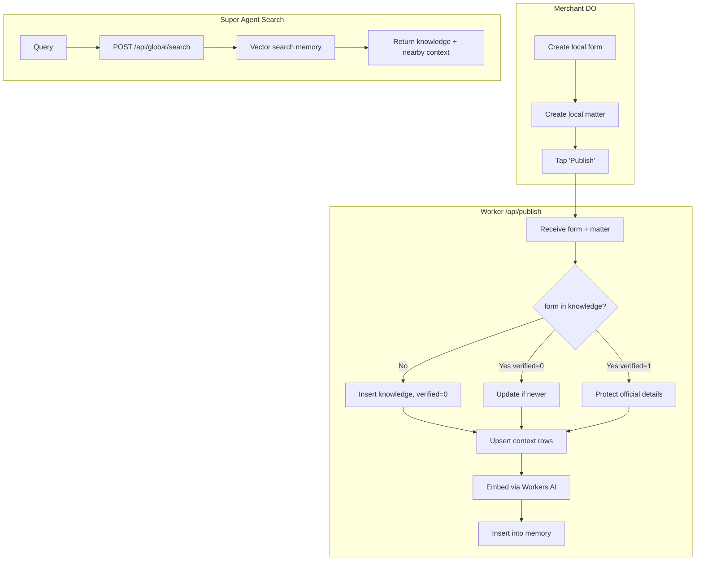

# 04 — Marketplace & Storefront

The federated product space (publish → global discovery) and the multi-tenant storefront engine on `tarai.space`.

---

## 1. Federated product space

Discovery and management are separate flows:

| Flow | Where | How |
| :--- | :--- | :--- |
| **Discovery (read)** | Turso `knowledge` + `context` + `memory` | semantic vector search at the edge |
| **Management (write)** | per-merchant DO (`form`/`matter`/`motion`/`bond`) | local-first, synced via Workers + DO |

### Publish flow (`/api/publish`)



### Turso `knowledge` (projected from `form`)
Abstract product/service definition (e.g. *Pepsi 500ml Can*).
| Field | Note |
| :--- | :--- |
| `id` | standard key/barcode (UPC/EAN/slug) |
| `title` | display name |
| `type` | `product`, `service`, `restaurant` |
| `verified` | 0 = crowdsourced, 1 = official brand |
| `brand` | denormalized for filtering |
| `data` | `image_url`, `manufacturer_id` |

### Turso `context` (echoed from `matter`)
Lossy public snapshot of a merchant's instance.
| Field | Note |
| :--- | :--- |
| `id` | mirrors `matter.id` (`store_101_pepsi`) |
| `knowledge` | FK → `knowledge.id` |
| `store` | storefront profile id |
| `value` | selling price |
| `stock` | 1 = in stock, 0 = out (boolean) |
| `geo` | H3 hex for proximity |
| `time` | snapshot watermark |

---

## 2. Storefront engine (`tarai.space`)

Cloudflare Workers serve multi-tenant shops + a global marketplace, reading live from the shared global Turso DB.

### Resources
| Resource | Detail |
| :--- | :--- |
| Storefront Worker | `storefront` — routes `*.tarai.space/*`, `market.tarai.space/*` |
| Write/Upload Worker | `s3storage` — `/api/publish`, uploads, AI vectors |
| Global Turso DB | `libsql://global-tarframework.aws-eu-west-1.turso.io` |
| Subdomain KV cache | `STORES` (subdomain → profile JSON, 5-min TTL) |

### Data mapping (legacy table names as in current code)
| Concept | Table | Detail |
| :--- | :--- | :--- |
| Storefront profile | `form`/`matter` type=`profile`, `public=1` | `data.subdomain`, `data.theme` |
| Product catalog | `form` type=`product`, `public=1` | `data.price` |
| Stock & variants | `matter` type=`variant`/`stock` | `qty`, `value`=price |
| Product→store link | `bond` | `src=productId, tgt=profileId, type='published_to'` |
| Orders | `matter` type=`order` + `motion` log | `value`=total, `data={items, shipping}` |

### Build status
| Feature | Done | Notes |
| :--- | :--- | :--- |
| Worker core & deploys | ✅ | secrets `TURSO_URL`/`TURSO_AUTH_TOKEN`, KV configured |
| Marketplace grid | ✅ | `market.tarai.space` lists public products by date |
| Product detail page | ✅ | `/p/:id`, variant price resolution, stock indicators |
| WhatsApp ordering | ✅ | one-tap prefilled button; mailto fallback |
| App publish integration | ✅ | "Publish Storefront" sends profile + product bonds |
| Wildcard DNS proxy | ❌ | needs orange-cloud `*.tarai.space` |
| Explicit subdomains | ❌ | uniqueness check + validation in app |
| Multi-item cart UI | ❌ | localStorage cart drawer |
| Edge checkout sync | ❌ | checkout API inserting order `matter` + `motion` 105 |
| Payment integration | ❌ | Stripe/Razorpay session + webhook → 802 PAY_SUCCESS |
| Custom domains | ❌ | Cloudflare SSL SaaS, resolve by host header |
| AI design tokens | ❌ | LLM visual JSON in `data.theme` → CSS |
| AI logo/banner | ❌ | prompt-to-image → S3 → profile |
| Structured SEO | ❌ | JSON-LD for products |

---

## 3. AI design engine (theme tokens)

To deliver Shopify/Webflow-grade aesthetics with no manual coding, the AI generates Design Tokens stored in `form.data.theme` (profile).

```json
{
  "colors": { "background":"#0F0F11","surface":"#16161A","primary":"#6366F1",
              "primaryHover":"#4F46E5","accent":"#F59E0B","textMain":"#F9FAFB",
              "textMuted":"#9CA3AF","border":"#27272A" },
  "typography": { "headingsFont":"Outfit","bodyFont":"Inter","baseFontSize":"16px",
                  "headingsWeight":"700","headingsCase":"none","letterSpacing":"-0.02em" },
  "spacing": { "siteMaxWidth":"1200px","gridGap":"24px","containerPadding":"32px","sectionSpacing":"64px" },
  "effects": { "borderRadius":"12px","buttonPadding":"12px 24px",
               "cardShadow":"0 8px 30px rgba(0,0,0,0.12)","backdropFilter":"blur(8px)","borderWidth":"1px" },
  "animation": { "transitionDuration":"200ms","transitionTiming":"cubic-bezier(0.4,0,0.2,1)","hoverScale":"1.02" }
}
```

### Pipeline
1. **Merchant prompt** — describes brand vibe (*"brutalist neon shoe store"*).
2. **LLM generation** — outputs the tokens JSON (+ optional custom CSS).
3. **Storage** — saved into `form.data.theme`.
4. **Edge injection** — storefront worker parses theme → CSS variables in the HTML shell:
   ```css
   :root {
     --color-bg: ${theme.colors.background};
     --font-headings: "${theme.typography.headingsFont}, sans-serif";
     --border-radius: ${theme.effects.borderRadius};
     --transition-speed: ${theme.animation.transitionDuration} ${theme.animation.transitionTiming};
   }
   ```
5. **Asset generation** — text-to-image logos/banners → S3 (presigned upload) → referenced in `theme.logo`/`theme.banner`.
