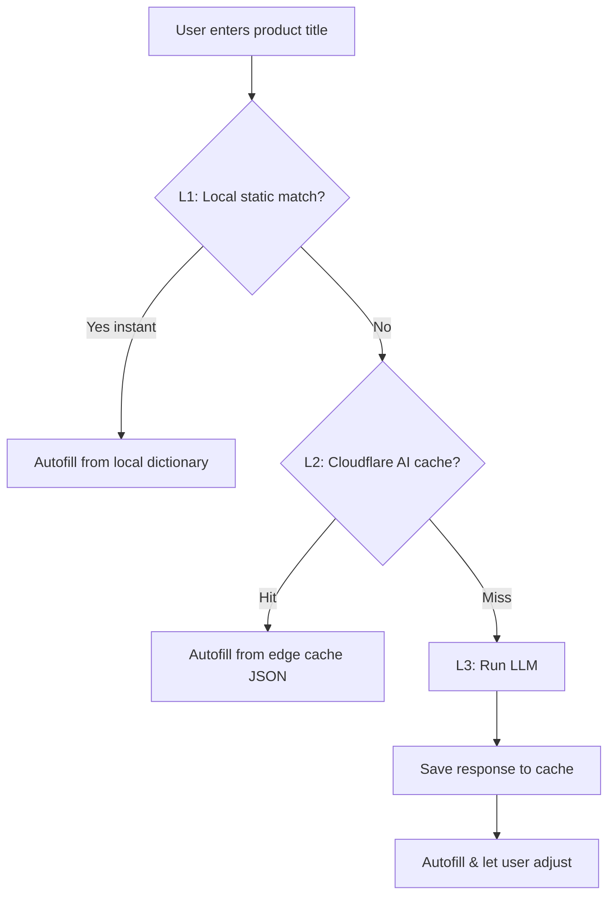

# 06 — AI Classification & Semantic Cache

How products get categories, tags, options (variants), and modifiers auto-filled — optimized for local-first speed and low LLM cost.

---

## 1. Strategy comparison

| Feature | Pure AI Generation | Predefined Manual | AI + Cloudflare Cache |
| :--- | :--- | :--- | :--- |
| Concept | LLM generates from title on the fly | Local dictionary, user selects | LLM but cached at edge |
| Latency | High (1.5–3s) | **Instant (0ms)** | Low (50–150ms hit; 2s miss) |
| Cost | High | **Zero** | Very low (up to 90% saved) |
| Offline | None | **Full** | None on miss |
| Accuracy | High but volatile | **100% reliable** | High, repeatable |
| Friction | **Zero** | Moderate | **Zero** |

---

## 2. Recommended hybrid tiered lookup



1. **Offline & instant for common items** — "Latte", "Pizza", "T-Shirt" autofill from local memory, no API call.
2. **Scale & savings** — uncommon items cached at the edge; millions of merchants sell overlapping products.
3. **Fallback magic** — truly unique items hit the LLM once, then cache.

---

## 3. Storage mapping

**Category & tags** → `form.data` (legacy `matter.data`):
```json
{ "cat":"food", "tags":["beverage","hot","caffeine"], "p":"3.50", "o":{ "s":["Small","Medium","Large"] } }
```

**Options / variants** → `matter` rows (legacy `mass`); the variant index maps to dimensions in `form.data.o`:
- `variant=0` Small · `variant=1` Medium · `variant=2` Large

**Modifiers** → linked via `bond` (legacy `relation`):
1. Create modifier blueprint in `form`, `type='product'`, `data={"mod":1}`.
2. Create price point in `matter` (e.g. `$0.50` extra shot).
3. Link: `src=prod_latte, tgt=prod_espresso_shot, type='modifier_of'`.

---

## 4. Cloudflare AI Gateway (exact cache)

Dashboard → AI > AI Gateway → create `tar-ai-gateway`, toggle **Cache Responses** on, set TTL (e.g. 86400s).

Proxy URL replaces the direct Gemini URL:
```text
https://gateway.ai.cloudflare.com/v1/{account_id}/tar-ai-gateway/google-ai-studio/v1/models/{model_id}:generateContent
```

| Header | Type | Value | Purpose |
| :--- | :--- | :--- | :--- |
| `cf-aig-cache-ttl` | Request | `86400` | override TTL for this prompt |
| `cf-aig-skip-cache` | Request | `true` | force live model (manual refresh) |
| `cf-aig-cache-status` | Response | `HIT`/`MISS` | audit cache state |

---

## 5. Semantic cache (the real win)

Exact cache only matches letter-for-letter. **Semantic cache** uses vector similarity to resolve paraphrases, typos, and re-orderings.

| User prompt | Exact cache | Semantic cache |
| :--- | :--- | :--- |
| `"Pepperoni Pizza"` | MISS (first) | MISS (first) |
| `"pepperoni pizza"` | MISS (case) | **HIT** (99%) |
| `"Pizza with Pepperoni"` | MISS (order) | **HIT** (95%) |
| `"Clasic Peperoni Pizza"` | MISS (typo) | **HIT** (91%) |

**Benefits for TAR:** standardized taxonomy (same prompt → same cached JSON → clean categories/tags, no noisy duplicates), consistent variant options across merchants, and cross-merchant reuse (Merchant B inherits Merchant A's "Espresso" modifiers).

### Native Cloudflare semantic cache
```text
User query → Worker → (1) Workers AI embed (bge-small-en) + (2) Vectorize query
   Cosine > 0.90 ? → HIT: read JSON from D1/KV
                   → MISS: call live LLM → save vector to Vectorize & D1
```

| Component | Role |
| :--- | :--- |
| Workers | central middleware |
| Workers AI `@cf/baai/bge-small-en-v1.5` | edge embeddings |
| Vectorize | native vector DB, nearest-neighbor |
| D1 / KV | final JSON output keyed by id |

### vs Redis semantic cache
| | CF AI Gateway | Redis Semantic |
| :--- | :--- | :--- |
| Match | exact string | semantic similarity |
| Infra | fully managed edge | Redis Stack + embedder |
| Perf | ~50ms | ~100ms |
| Cost | free | Redis hosting + embed calls |
| Best for | standardized SKUs | free-text, conversational |

---

## 6. Cost at scale (1M classifications/mo)

| Cost center | Pure LLM | Exact cache | Semantic cache |
| :--- | :--- | :--- | :--- |
| Cache hit rate | 0% | ~20% | ~80% |
| LLM requests/mo | 1,000,000 | 800,000 | 200,000 |
| LLM call cost | $300 | $240 | $60 |
| Embedding cost | $0 | $0 | $20 (Workers AI) |
| DB/cache cost | $0 | $0 | $1 (Vectorize) |
| **Total** | **$300** | **$240** | **$81** |
| Savings | baseline | 20% | **73%** |

Common products ("Coke", "Coca-Cola", "Coca Cola 330ml") call the LLM once globally. Creating a 384-dim embedding is ~15× cheaper than a full generative completion.
