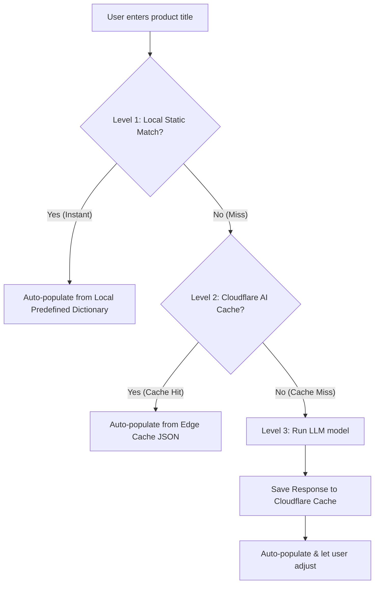

# Product Options, Modifiers & Category Classification Strategy

To add **options (variants)**, **categories/tags**, and **modifiers** to products in `tarapp/app/workspace.tsx`, we compare three strategies. We then outline the recommended hybrid approach optimized for local-first performance.

---

## 1. Strategy Comparison

| Feature | 1. Pure AI Generation | 2. Predefined Manual Selection | 3. AI + Cloudflare AI Cache |
| :--- | :--- | :--- | :--- |
| **Concept** | LLM generates categories, tags, options, and modifiers dynamically from the product title on the fly. | A local list of industries (F&B, Retail) with standard options/modifiers. User selects manually. | LLM generates details, but results are cached globally at Cloudflare's edge using AI Gateway. |
| **Latency** | High (1.5s - 3s) | **Instant (0ms)** | Low (50ms - 150ms for cache hits; 2s on miss) |
| **Cost** | High ($ per 1k requests) | **Zero ($0.00)** | Very Low (up to 90% savings via cache hits) |
| **Offline Support** | None (Requires Internet) | **Full (Offline-first)** | None on cache miss (Requires Internet) |
| **Accuracy** | High but volatile (Hallucinations) | **100% Reliable & Standardized** | High (same as AI, but repeatable) |
| **User Friction** | **Zero (Auto-fills instantly)** | Moderate (Requires clicking/scrolling) | **Zero (Auto-fills instantly)** |

---

## 2. The Recommended "Perfect Way": The Hybrid Tiered Model

The most robust approach for a local-first application like TAR is a **hybrid tiered lookup pipeline** that combines the speed and offline capability of predefined data with the magic and zero-friction of cached/live AI.



### Why this is the best approach:
1. **Offline & Instant for Common Items**: If a user types "Latte", "Pizza", or "T-Shirt", the app immediately autofills categories, tags, and standard sizes/modifiers from local memory without sending an API request.
2. **Scale & Cost Savings**: Common custom items not in the local database (e.g., "Double Choc Chip Cookie") will be cached at the Cloudflare Edge. Your API bills are minimized because millions of merchants globally sell overlapping products.
3. **Fallback Magic**: For completely unique items, the LLM generates a tailored configuration on-the-fly and caches it for future requests.

---

## 3. Data Schema Implementation (TAR Alignment)

To align with the schemas defined in `docs/plan.md` and `docs/sampleproduct2.md`, here is how you store the output:

### A. Category & Tags (Stored in `matter.data`)
Classifications are stored inside the core product `matter` row inside the `data` JSON object:
```json
{
  "cat": "food",
  "tags": ["beverage", "hot", "caffeine"],
  "p": "3.50",
  "o": {
    "s": ["Small", "Medium", "Large"]
  }
}
```

### B. Options / Variants (Stored in `mass` table)
Each size/color variant maps to a `mass` realization row. The `variant` column stores the index mapping to the option dimensions in `matter.data.o`:
- `variant = 0` (Small)
- `variant = 1` (Medium)
- `variant = 2` (Large)

### C. Modifiers (Linked via `relation` table)
Modifiers are distinct product blueprints linked to the parent product using the relation graph:
1. Create a modifier blueprint in `matter` with `type = 'product'` and `data = {"mod": 1}`.
2. Create a price point in `mass` for the modifier (e.g. `$0.50` for Extra Espresso Shot).
3. Connect them in the `relation` table:
   - `src` = `prod_latte` (Parent Product ID)
   - `tgt` = `prod_espresso_shot` (Modifier Product ID)
   - `type` = `'modifier_of'` (Relation link)

---

## 4. Cloudflare AI Gateway Integration & Caching DDL

Here is how you set up and query Cloudflare AI Gateway with caching for Gemini (Vertex AI / Google AI Studio).

### A. Cloudflare Dashboard Settings
1. Go to **AI > AI Gateway** in your Cloudflare dashboard.
2. Create a gateway named `tar-ai-gateway`.
3. In gateway settings, toggle **Cache Responses** to **On**.
4. (Optional) Set a default **TTL (Time to Live)** (e.g., 86400 seconds / 24 hours).

### B. Endpoint Construction
Replace the direct Google/Gemini URL in your app with the Cloudflare AI Gateway proxy URL:

*   **Google AI Studio API / Gemini Direct:**
    ```text
    https://gateway.ai.cloudflare.com/v1/{account_id}/tar-ai-gateway/google-ai-studio/v1/models/{model_id}:generateContent
    ```
*   **Google Vertex AI API:**
    ```text
    https://gateway.ai.cloudflare.com/v1/{account_id}/tar-ai-gateway/google-vertex-ai/v1/projects/{project_id}/locations/{region}/publishers/google/models/{model_id}:predict
    ```

### C. HTTP Request/Response Headers
You can customize caching dynamically in your frontend/backend code using standard headers:

| Header Name | Type | Value / Description | Purpose |
| :--- | :--- | :--- | :--- |
| **`cf-aig-cache-ttl`** | Request | `86400` (in seconds) | Overrides gateway TTL to cache this specific product prompt for 24 hours. |
| **`cf-aig-skip-cache`** | Request | `true` | Forces Cloudflare to skip the cache and hit the model live (useful for manual refresh requests). |
| **`cf-aig-cache-status`** | Response | `HIT` or `MISS` | Read this header in your app to audit performance and debug cache states. |

---

## 5. Redis Semantic Cache (`langchain-redis`)

While Cloudflare AI Gateway caches requests based on **exact string matching** (the prompt must match letter-for-letter), **Redis Semantic Cache** (often used with LangChain) uses **vector similarity search** to resolve semantically equivalent prompts.

### How it Works
1. **Prompt Embedding**: When a user inputs a query (e.g. *"Spicy Pepperoni Pizza"*), the prompt is converted into a vector embedding.
2. **Vector Search in Redis**: Redis Stack/Cloud searches its vector database for previously stored prompts.
3. **Similarity Threshold**: If a previous prompt matches within a threshold (e.g., cosine distance `< 0.2` for *"Pepperoni Pizza with chilli"*), it triggers a **cache hit** and returns the saved result.
4. **LLM Bypass**: If no match is found, the query hits the LLM and the result is cached.

### Comparison: Cloudflare AI Gateway vs. Redis Semantic Cache

| Feature | Cloudflare AI Gateway Cache | Redis Semantic Cache |
| :--- | :--- | :--- |
| **Matching Type** | **Exact String Match** | **Semantic Similarity Match** |
| **Example Match** | `"Latte"` matches only `"Latte"` | `"Latte"` matches `"Hot Latte"`, `"Caffe Latte"` |
| **Infrastructure** | Fully Managed at the Edge (no setup) | Requires a Redis Stack instance + embedding generator |
| **Performance** | Instant (~50ms) | Low (~100ms, requires embedding computation) |
| **Cost** | Free (Part of Cloudflare AI Gateway) | Requires Redis Hosting + Embedding API call costs |
| **Ideal Use Case** | Highly standardized products (SKUs, exact names) | Free-text search, conversational queries, paraphrases |

---

## 6. Custom Semantic Caching on Cloudflare (Natively)

While Cloudflare AI Gateway does not natively support semantic caching out-of-the-box yet (it is currently on their roadmap), you can easily build a custom semantic cache within the **Cloudflare Ecosystem** using their native serverless tools.

### The Cloudflare Stack Architecture
```text
  ┌──────────────────┐
  │ User enters      │
  │ "Spicy Pepperoni"│
  └────────┬─────────┘
           │
           ▼
  ┌──────────────────┐
  │ Cloudflare       │
  │ Worker           │
  └────────┬─────────┘
           │
           ├───────────────────────┐
           ▼ (1. Generate Vector)  ▼ (2. Query Index)
  ┌──────────────────┐    ┌──────────────────┐
  │ Workers AI       │    │ Cloudflare       │
  │ (bge-small-en)   │    │ Vectorize        │
  └──────────────────┘    └────────┬─────────┘
                                   │
                           ┌───────┴───────┐
                     Hit   │ Cosine > 0.90?│ Miss
                    ┌──────┴───────────────┴──────┐
                    ▼                             ▼
         ┌──────────────────┐            ┌──────────────────┐
         │ Read cache value │            │ Call Live LLM    │
         │ from D1 / KV     │            │ (Gemini / Vertex)│
         └──────────────────┘            └────────┬─────────┘
                                                  │
                                                  ▼
                                         ┌──────────────────┐
                                         │ Save vector to   │
                                         │ Vectorize & D1   │
                                         └──────────────────┘
```

### Components:
1.  **Cloudflare Workers**: Acts as the central middleware.
2.  **Workers AI (`@cf/baai/bge-small-en-v1.5`)**: Generates embeddings for prompts instantly at the edge.
3.  **Vectorize**: Cloudflare's native vector database. Stores the prompt embeddings and finds nearest neighbors.
4.  **D1 Database or KV Storage**: Stores the final JSON output (categories, options, modifiers) keyed by target ID.

---

## 7. How Semantic Caching Solves Options, Modifiers & Category Classification

When cataloging products, merchants enter product names with infinite micro-variations (typos, abbreviations, synonyms, or word re-orderings). Here is how a semantic cache handles these scenarios compared to traditional caches:

### A. Resolving Natural Language Variations (High Cache Hit Rate)

| User Prompt | Exact Cache (AI Gateway) | Semantic Cache (Redis/Vectorize) | Action Taken |
| :--- | :--- | :--- | :--- |
| **`"Pepperoni Pizza"`** | **MISS** (First time) | **MISS** (First time) | Runs LLM ➔ Caches response. |
| **`"pepperoni pizza"`** | **MISS** (Case sensitive) | **HIT** (99% match) | Returns cached F&B details instantly. |
| **`"Pizza with Pepperoni"`**| **MISS** (Word re-ordering) | **HIT** (95% match) | Returns cached F&B details instantly. |
| **`"Clasic Peperoni Pizza"`**| **MISS** (Typo & prefix) | **HIT** (91% match) | Returns cached F&B details instantly. |

### B. Specific Benefits for TAR Catalog Systems

1.  **Standardized Categories & Tags**:
    *   *Problem*: LLMs might return `"F&B"` for one query, `"food"` for another, and `"restaurant"` for a third.
    *   *Semantic Cache Solution*: Because similar product prompts map to the *exact same cached JSON*, they will share identical, clean taxonomy (e.g., category `"food"` and tags `["pizza", "hot"]`) rather than generating noisy duplicates.
2.  **Consistent Options (Variants)**:
    *   *Problem*: For clothing, an LLM might suggest `["S", "M", "L", "XL"]` one time and `["Small", "Medium", "Large"]` another time.
    *   *Semantic Cache Solution*: When a user types *"Men's Graphic Tee"* and another types *"Graphic Tee for Men"*, they both fetch the exact same cached variant options (`["S", "M", "L"]`). This ensures consistent database realisations.
3.  **Cross-Merchant Suggestion Reuse**:
    *   Since many merchants sell standard items (e.g., *"Espresso"*, *"Cheese Burger"*, *"Coke"*), a semantic cache allows Merchant B to instantly get the correct modifiers (`"Extra Shot"`, `"Milk Options"`) and categories generated by Merchant A's previous query.

---

## 8. Cost Savings & Financial Analysis

Here is a cost projection comparison at scale (assuming **1,000,000 product additions per month** across all users, using a standard LLM costing `$0.15 / 1M input tokens` and `$0.60 / 1M output tokens` — roughly `$0.0003` per classification request):

### A. Cache Hit Rates & Token Usage
*   **Pure LLM (No Cache)**:
    *   Cache Hit Rate: **0%**
    *   LLM API Requests: 1,000,000/mo
*   **Exact Cache (Cloudflare AI Gateway)**:
    *   Cache Hit Rate: **~20%** (misses variations in spacing, casing, spelling, and word ordering).
    *   LLM API Requests: 800,000/mo
*   **Semantic Cache (Redis / CF Vectorize)**:
    *   Cache Hit Rate: **~80%** (resolves all semantic duplicates across the global catalog).
    *   LLM API Requests: 200,000/mo

### B. Monthly Cost Comparison (1M Requests)

| Cost Center | 1. Pure LLM | 2. Exact Cache (CF Gateway) | 3. Semantic Cache (Redis/Vectorize) |
| :--- | :--- | :--- | :--- |
| **LLM Call Costs** | $300.00 | $240.00 | $60.00 |
| **Embedding Call Costs** | $0.00 | $0.00 | $20.00 (CF Workers AI text-embeddings) |
| **Database/Cache Cost** | $0.00 | $0.00 (Free Edge Cache) | $1.00 (CF Vectorize queries) |
| **Total Monthly Cost** | **$300.00** | **$240.00** | **$81.00** |
| **Net Savings** | *Baseline* | **20% Savings** | **73% Savings** |

### C. Direct Savings Factors
1.  **Eliminates Redundant Processing**: Common products like `"Coke"`, `"Coca-Cola"`, `"Coca Cola 330ml"` only call the LLM once globally. Subsequent queries hit the cache, saving 100% of LLM cost.
2.  **Edge Compute Efficiency**: Cloudflare Vectorize and Workers AI embeddings cost a fraction of a full LLM completion. Creating a 384-dimension embedding is roughly **15x cheaper** than running a full generative LLM completion to classify category, tags, and options.
