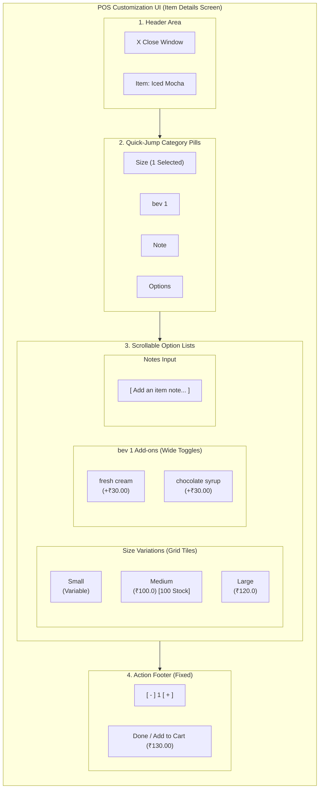
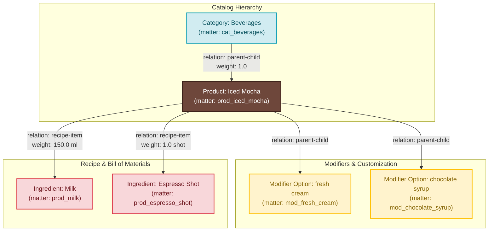
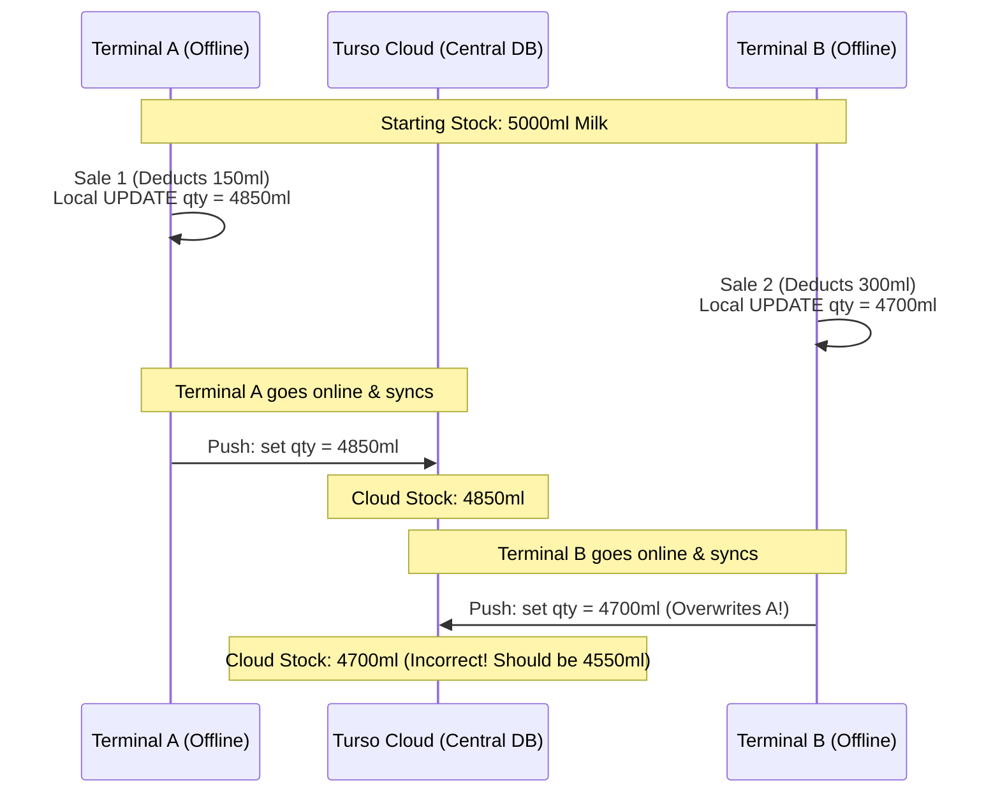
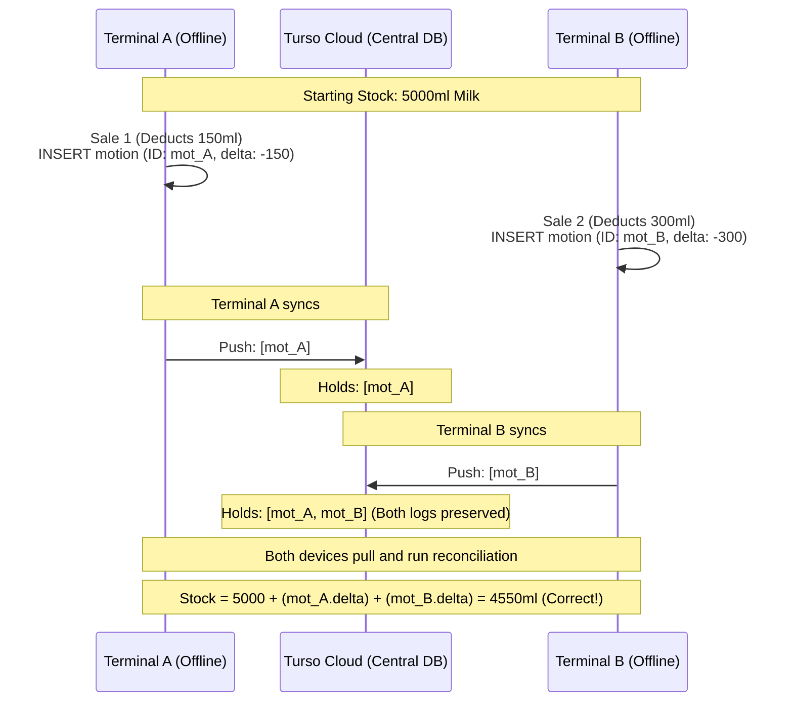

# POS Item Customization & Ingredient Stock Architecture

This document provides a visual walkthrough of how product configurations (variations, modifiers) and recipe-based ingredient consumption are modeled, synchronized, and resolved inside the local-first TAR sync architecture.

---

## 1. Visual POS Item Cards (UI State Lifecycle)

Below is a visual representation of how items, customizations, cart details, and raw inventory are rendered as UI cards in the POS terminal.

````carousel
### 🛒 Card 1: Catalog Grid Tile
---
```
+------------------------------------------+
|  Iced Mocha                              |
|                                          |
|  [ #6E473B Brown Tile ]                  |
|  Price: ₹100.00 - ₹120.00                |
|  Category: Beverages                     |
+------------------------------------------+
```
* **Database Source:** `matter` table (`type = 'product'`)
* **Styling details:** Handled in `matter.data` (`{"tile_style": {"color": "#6E473B"}}`)

<!-- slide -->
### ⚙️ Card 2: Customization & Modifier Card
---
```
+------------------------------------------+
|  Configure: Iced Mocha                   |
|                                          |
|  SIZE (Select 1):                        |
|  [ ] Small  (Variable)                   |
|  [x] Medium (₹100.00)                    |
|  [ ] Large  (₹120.00)                    |
|                                          |
|  MODIFIERS:                              |
|  [x] fresh cream (+₹30.00)               |
|  [ ] chocolate syrup (+₹30.00)           |
+------------------------------------------+
```
* **Database Source:** `relation` table (`type = 'parent-child'`)
* **Variant price mapping:** `mass` table (`type = 'stock'`, value = `100.00`)

<!-- slide -->
### 🧾 Card 3: Active Cart Item Card
---
```
+------------------------------------------+
|  1x Iced Mocha (Medium)                  |
|  - Add-on: fresh cream (+₹30.00)         |
|  - Note: "Extra cold"                    |
|                                          |
|  Price: ₹130.00                          |
+------------------------------------------+
```
* **Database Source:** `mass` table (`type = 'cart'`)
* **Selection details:** Stored in `mass.data` JSON payload

<!-- slide -->
### 📦 Card 4: Inventory Stock Card
---
```
+------------------------------------------+
|  Ingredient: Milk                        |
|                                          |
|  Stock level: 4550.0 ml                  |
|  Status: [ 🟢 Adequate ]                  |
|  Cost: ₹0.10 / ml                        |
+------------------------------------------+
```
* **Database Source:** `mass` table (`type = 'stock'`, qty = `4550.0`)
* **Alert Trigger:** Calculated dynamically on stock thresholds
````

---

## 2. User-Friendly UI Layout Wireframe (Design Concept)


This diagram outlines the screen layout layout for customizing items, matching the Square Android POS structure.



### Why this Layout is User-Friendly:
1. **Quick-Jump Pills:** Allow the operator to instantly skip long lists (e.g. jumping directly to "Note" or "bev 1") using a sticky horizontal navigation bar.
2. **Touch-Friendly Targets:** Size selections and add-ons are styled as large block tiles rather than tiny checkboxes, preventing selection errors on small POS touchscreens.
3. **Contextual Badges:** Shows stock level numbers (e.g., `[100 Stock]`) directly on the size tile before selection so operators can alert customers if a choice is low on stock.

---

## 3. Structural Schema Mapping (Visual Database Blueprint)

The catalog structure uses the core **`matter`** table for identities and the **`relation`** table to build the directed graph (Categories, Modifiers, and Ingredient Recipes).



---

## 4. Table Instances (Step-by-Step Data Flow)

Here is how rows are populated in the database to represent the above diagram.

### A. Identities (`matter` Table)
Defines the blueprint templates for products, categories, modifiers, and ingredients.

| id | code | type | scope | title | data (JSON Payload) |
| :--- | :--- | :--- | :--- | :--- | :--- |
| `cat_beverages` | `CAT_BEV` | `product` | `g` | `"Beverages"` | `{"is_category": true}` |
| `prod_iced_mocha` | `MOCHA` | `product` | `g` | `"Iced Mocha"` | `{"description": "Rich espresso with cocoa..."}` |
| `mod_fresh_cream` | `MOD_CREAM` | `product` | `g` | `"fresh cream"` | `{"is_modifier": true}` |
| `prod_milk` | `ING_MILK` | `product` | `g` | `"Milk"` | `{"is_ingredient": true, "unit": "ml"}` |
| `prod_espresso_shot` | `ING_SHOT` | `product` | `g` | `"Espresso Shot"`| `{"is_ingredient": true, "unit": "shot"}` |

### B. Structural Network (`relation` Table)
Maps how items link together (Category placement, modifier options, and recipe weights).

| src | tgt | type | weight | Note / Role |
| :--- | :--- | :--- | :--- | :--- |
| `cat_beverages` | `prod_iced_mocha` | `parent-child` | `1.0` | Assigns Mocha to Beverages category (order position `1`) |
| `prod_iced_mocha` | `mod_fresh_cream` | `parent-child` | `1.0` | Links "fresh cream" as a modifier choice |
| `prod_iced_mocha` | `prod_milk` | `recipe-item` | `150.0` | Recipe: Mocha requires **150 ml** of Milk |
| `prod_iced_mocha` | `prod_espresso_shot` | `recipe-item` | `1.0` | Recipe: Mocha requires **1 shot** of Espresso |

### C. Physical Realization & Inventory (`mass` Table)
Tracks the physical stock quantities on hand for raw ingredients.

| id | matter | type | scope | qty | value (cost/price) |
| :--- | :--- | :--- | :--- | :--- | :--- |
| `mas_stock_milk` | `prod_milk` | `stock` | `w:kitchen` | **`5000.0`** | `0.10` / ml |
| `mas_stock_espresso` | `prod_espresso_shot` | `stock` | `w:kitchen` | **`200.0`** | `15.00` / shot |
| `mas_price_cream` | `mod_fresh_cream` | `stock` | `w:kitchen` | `9999.0` | **`30.00`** (price) |

---

## 5. Conflict-Free Sync & Resolution Model

> [!IMPORTANT]
> To prevent offline synchronization conflicts using **Turso Sync**, devices **never overwrite the same cell** concurrently. Instead, they write append-only transaction logs.

### The Problem: Concurrent Offline Direct Updates (Overwrites)



### The Solution: Append-Only Event Logs (`motion` Table)

Instead of updating the `qty` cell directly, both terminals insert a unique transaction row in the `motion` table representing the change (`delta`).



---

## 6. Query & Ledger Reconciliation Patterns

### Computing Stock Levels Dynamically (Ledger Run)
To calculate the current inventory level of an ingredient by combining its base inventory with sales logs:

```sql
SELECT 
    m.id AS ingredient_id,
    m.title AS ingredient_name,
    -- (Base Stock) + (Sum of all offline & online transaction changes)
    (base_stock.qty + COALESCE(SUM(log.delta), 0)) AS current_stock
FROM matter m
JOIN mass base_stock ON base_stock.matter = m.id AND base_stock.type = 'stock'
LEFT JOIN motion log ON log.stream = m.id AND log.action = 405 -- SCM Deductions
GROUP BY m.id;
```

> [!TIP]
> **Performance Optimization:** In production, do not scan the entire `motion` log history every time. Maintain a **`mass`** record as a materialized cache. When a sync event completes, apply the incoming `motion.delta` fields to update `mass.qty` in a single fast write query.
