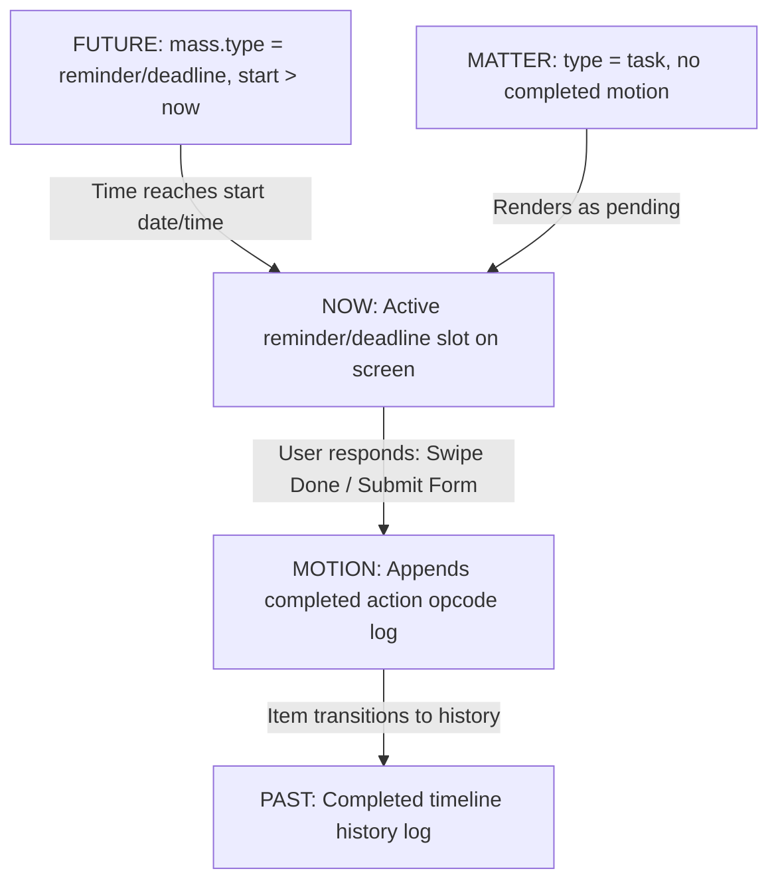

# TAR Space-Time Timeline Architecture

The Home Screen functions as a **Spatiotemporal Coordinator**. It organizes resources and actions across Space (where) and Time (when) using four database primitives.

---

## 1. The Space-Time Coordinates

*   **Time (When):** Governed by the timeline lanes:
    $$\text{Future (Scheduled)} \longrightarrow \text{Now (Active / Pending)} \longrightarrow \text{Past (Completed History Log)}$$
*   **Space (Where):** Guided by physical locations (`mass.geo`) and database domains (`scope` fields).

---

## 2. Core Database Primitives & Home Screen Actions

| Primitive | Definition (The "What") | Home Screen Representation | User Action (Spatiotemporal Response) |
| :--- | :--- | :--- | :--- |
| **MATTER** | **Identity Blueprint** (Template/Schema) | Product catalogs, tasks, form blueprints, documentation notes. | Instantiate, view details, or fill out a form template. |
| **MASS** | **Physical Allocation** (Qty, Time, Geo) | Stock quantities, scheduled calendar/shift slots, checkout carts. | Count items, check-in to a location (`geo`), start a shift, checkout. |
| **MOTION** | **Timeline Action Opcode** (Event log) | Append-only event streams (e.g. clock-in, checkout, dispatch). | Swipe to mark done, submit form. Appends a completed opcode log. |
| **RELATION** | **Structural Connection** (Links) | Hierarchies, dependencies (`blocked_by`), assignments (`assigned_to`). | Unlocks downstream items once prerequisites are cleared. |

---

## 3. Scope Domains & Schema Mapping

The collaboration scopes from `tagents.tsx` map to specific database primitive schemas:

| Scope (Team / Agent) | Matter (Identity Blueprint) | Mass (Physical Allocation) | Motion (Action Opcode Logs) | Relation (Structural Links) |
| :--- | :--- | :--- | :--- | :--- |
| **Personal** | `'note'` (docs), `'product'` (private), `'task'` | `'cart'` (personal shopping), `'stock'` (home inventory) | `806: EXPENSE_RECORD` | `'parent-child'` (notes index) |
| **Global** | `'profile'` (system user accounts), `'product'` | - | - | `'assigned_to'` (workspaces) |
| **Family** | `'task'` (chores), `'note'` (shopping lists) | `'slot'` (family calendar) | `701: BOOKED` | `'parent-child'` |
| **Team / Work** | `'task'` (project task entries) | `'slot'` (work milestone deadlines) | `202: SHIFT_START`, `604: FORM_SUBMIT` | `'blocked_by'`, `'assigned_to'` |
| **Friends** | `'note'` (event plans) | `'slot'` (gathering/activity slots) | `802: PAYMENT_SUCCESS` | `'parent-child'` |
| **Storefront** | `'product'` (catalog menu items) | `'cart'` (checkout basket), `'stock'` (shelf counts) | `101: SOLD`, `105: ORDER_PLACED`, `109: DELIVERED` | `'parent-child'` (menu indexes) |
| **Warehouse** | `'product'` (bulk wholesale packs) | `'stock'` (aisle/bin storage coordinates) | `405: TRANSFER_OUT` | `'parent-child'` |
| **Client / CRM** | `'profile'` (customer accounts) | `'lead'` (sales deals), `'ticket'` (service tickets) | `303: LEAD_CREATED`, `306: TICKET_OPEN`, `308: RESOLVED` | `'assigned_to'` (sales rep mapping) |
| **Campaigns** | `'form'` (opt-in layouts) | `'form_task'` (active campaigns) | `601: PUSH_SENT` | `'submits_to'` |
| **Forms** | `'form'` (survey, dynamic checklist sheets) | `'form_task'` (running check instances) | `604: FORM_SUBMIT` | `'submits_to'` (linking to template) |
| **HR / Staff** | `'profile'` (staff details) | `'shift'` (attendance schedules) | `501: CLOCK_IN`, `502: CLOCK_OUT` | `'assigned_to'` (shift rosters) |
| **Logistics** | - | `'trip'` (active delivery / passenger routes) | `401: DISPATCHED`, `402: IN_TRANSIT` | `'assigned_to'` (mapping drivers) |

---

## 4. Lifecycle Flow of a Task/Event



---

## 5. Domain Walkthrough: POS & Kitchen System

How point-of-sale checkout and kitchen order queues map onto the Space-Time Timeline:

| POS Component | Primitive | Space-Time Timeline Location | User Action / Spatiotemporal Response |
| :--- | :--- | :--- | :--- |
| **Menu Items & Pricing** | `matter (type='product')` | **Create Screen**: Static catalog lists. | Cashier selects items to populate a new order. |
| **Cashier Shift / Booking** | `mass (type='slot')` | **`[ FUTURE ]` / `Now`**: Shift calendar blocks. | Cashier clocks in to activate register session (`geo`). |
| **Dining Cart / Open Tab** | `mass (type='cart')` | **`Now`**: Active pending checkouts. | Cashier adds items or adjusts item quantities. |
| **Stock Inventory levels** | `mass (type='stock')` | **`Now`**: Low shelf warning alerts. | Clerk restocks shelves from backroom warehouse storage. |
| **Kitchen Order Status** | `motion (action=206)` | **`Now` (Active Queue)**: Fired preparation order. | Chef prepares food, then marks it ready to dispatch. |
| **Receipts & Audits** | `motion (action=201)` | **`Past`**: Completed sales history log. | Manager reviews daily register cash reconciliation. |
| **Menu Modifier Groups** | `relation (type='parent-child')` | **Item Selector Modal**: Custom toppings mapping. | Cashier selects modifier groups (burger side options). |
| **Register Operator** | `relation (type='assigned_to')` | **Operator Header**: Active terminal operator. | Cashier logs into their local profile account. |

---

## 6. Agent Roles & Associated Skills

Below is the directory of collaborating **Agents** (Scope domains) and the specific **Skills** (functional capabilities) they execute:

| Agent / Scope Category | Core Skills | Associated Tools | Target Outputs (Timeline Actions & Primitives) |
| :--- | :--- | :--- | :--- |
| **Personal** | Note-taking, Todo scheduling, Expense tracking. | Sticky notes editor, Task planner, Expense logger | Private notes (`note`), Personal expenses (`806`). |
| **Global** | Public catalog syncing, User administration. | Database synchronizer, Public catalog parser | Global identity profiles (`profile`), Public catalog indexes. |
| **Family** | Shared calendar scheduling, Domestic chore auditing. | Shared checklist, Family calendar calendar widget | Event slots (`slot`), Shared chore logs (`701`). |
| **Team / Work** | Sprint project tracking, Task dependency resolution. | Gantt dependency chart, Kanban task assignment board | Task allocations (`task`), Opcode events (`202`, `604`). |
| **Friends** | Gathering scheduling, Peer payment splitting. | Payment split calculator, RSVP share links | Activity slots (`slot`), Bill receipts (`802`). |
| **Storefront** | Retail POS checkout, Local shelf replenishment, Cart curation. | Barcode scanner, POS register UI, Shopping cart editor | Customer carts (`cart`), Sales receipts (`101`, `105`, `109`). |
| **Warehouse** | Bin storage allocation, Bulk shipping validation. | QR code / Aisle scanner, Aisle placement locator | Inventory counts (`stock`), Dispatch logs (`405`). |
| **Client / CRM** | Lead pipeline routing, Helpdesk ticket auditing. | CRM sales pipeline board, Support ticket composer | Sales leads (`lead`), Support folders (`ticket`), CRM events (`303`). |
| **Campaigns** | Newsletter push delivery, Signup conversion tracking. | Push broadcast manager, Opt-in form publisher | Campaign tasks (`form_task`), Push logs (`601`). |
| **Forms** | Dynamic field validation, Questionnaire compilation. | Dynamic form compiler, Submission spreadsheet viewer | Checklist blueprints (`form`), Submission logs (`604`). |
| **HR / Staff** | Shift roster planning, Time-clock auditing, Leave approval. | Time-clock clock-in widget, Shift planner board | Roster lists (`shift`), Attendance logs (`501`, `502`). |
| **Logistics** | Fleet dispatching, Driver route tracking. | GPS route optimizer, Fleet dispatch map tracker | Transit trips (`trip`), Dispatch events (`401`, `402`). |

---

## 7. Designing UI Access for Entity Types & Opcodes

To make the database schemas (`matter`, `mass`, `motion`) easily accessible and configurable for non-technical users, the UI should translate these technical primitives into three core interface patterns:

### Pattern A: The Agent Playbook & Skill Toggle Panel
An interactive settings panel inside the **Teams & Agents** details view where admins can toggle what data primitives a specific agent can interact with.

```
+-----------------------------------------------------+
| STOREFRONT AGENT PLAYBOOK                           |
+-----------------------------------------------------+
| [Skill] Manage Storefront Catalog                    |
|   - Toggled Matter: [x] product                     |
|                                                     |
| [Skill] Conduct Checkout                            |
|   - Toggled Mass:   [x] cart   [x] stock            |
|   - Toggled Motion: [x] SOLD (101)  [x] REFUND (111)|
+-----------------------------------------------------+
```

### Pattern B: The Global Space-Time Action Palette
A centralized bottom drawer (Quick Action Palette) that groups allowed creation and transaction actions by database primitive:

| UI Drawer Category | Database Action | Permitted Inputs | Associated UI Control |
| :--- | :--- | :--- | :--- |
| **1. Define Blueprint (MATTER)** | `INSERT INTO matter` | `'product'`, `'task'`, `'form'`, `'note'` | Form template selection picker |
| **2. Allocate Resource (MASS)** | `INSERT INTO mass` | `'stock'`, `'slot'`, `'cart'`, `'trip'`, `'shift'` | Calendar date/time scheduler + map locator |
| **3. Dispatch Action (MOTION)** | `INSERT INTO motion` | Opcode actions (`101` Sold, `206` Fire, `501` Clock-in) | Quick-tap action grid with haptic feedback buttons |

### Pattern C: Unified Timeline Filtering Chips
A horizontal scrolling chip-bar at the top of the Home Screen to dynamically slice the spatiotemporal feed:

*   `[All]` $\rightarrow$ Runs unrestricted query.
*   `[Commerce]` $\rightarrow$ Filters `motion.action BETWEEN 100 AND 199` + `mass.type = 'cart'`.
*   `[Logistics]` $\rightarrow$ Filters `motion.action BETWEEN 400 AND 499` + `mass.type = 'trip'`.
*   `[HR & Staff]` $\rightarrow$ Filters `motion.action BETWEEN 500 AND 599` + `mass.type = 'shift'`.


